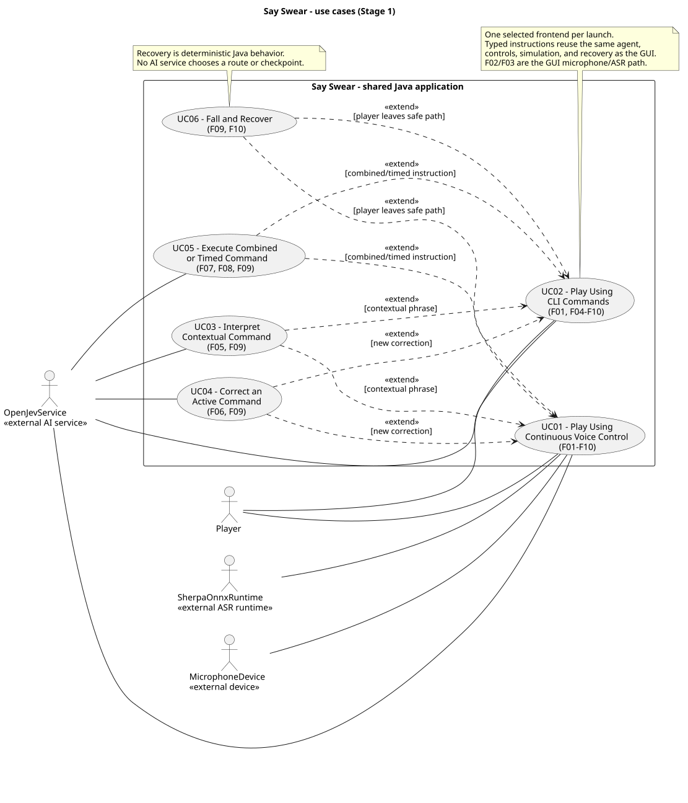
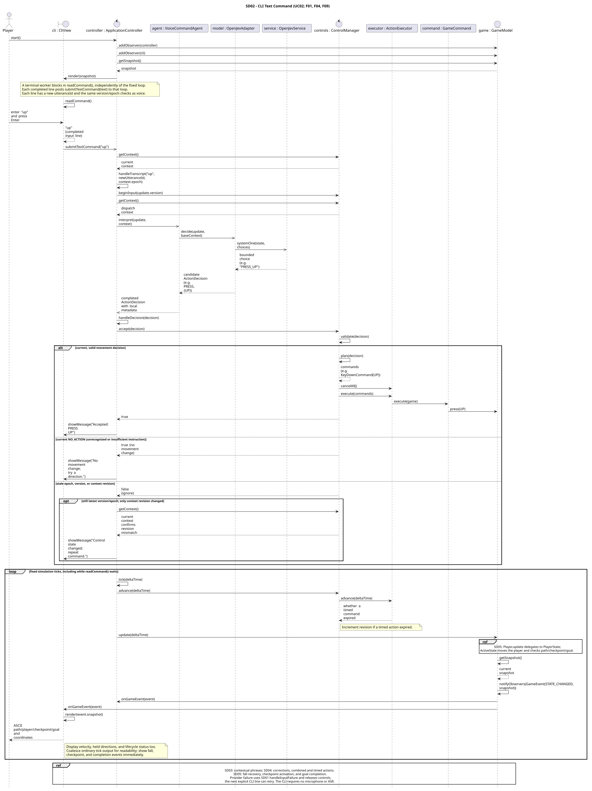
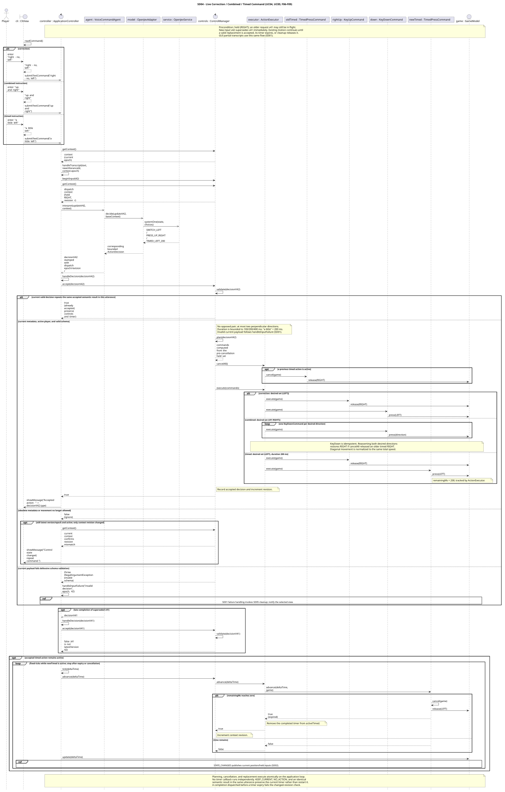
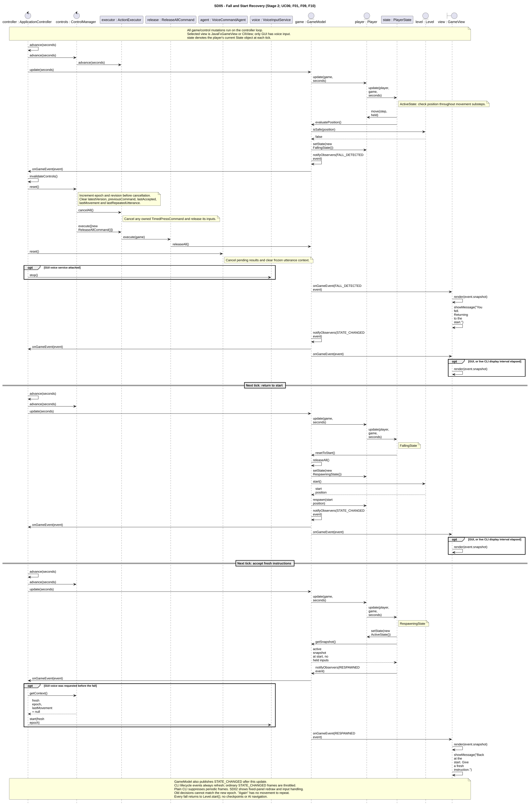

# Say Swear

**Say Swear: An AI Voice-Controlled 2D Precision Game**

EECS 3311 · Fall 2026 · Stage 1 Project Design Report

This report specifies a **proposed Java application**. Stage 1 contains design documentation, not application implementation or test results. The course's `stage1.pdf` is the detailed rubric; the professor's clarifications require both GUI and CLI access and **UMLet** diagrams. The repository contains seven SVG diagrams exported manually from UMLet and embedded below.

**Design revision.** This revision adopts the selected current design: a local SemIf/Qwen decision service, structured movement memory for “again,” recovery at the level start after every fall, and a terminal interface that preserves command editing during updates. Feature, use-case, and sequence identifiers remain stable. Earlier designs remain available in Git history, including revision `56da5fd`; the UMLet-exported SVGs shown here are the submission diagrams for this report.

## 1. Project Overview

### 1.1 Problem and Motivation

Say Swear explores natural-language control in a small precision/rage game. The player guides one character along a narrow, winding 2D path suspended over a void. Leaving the safe path causes a fall and a return to the **level start**. Reaching the goal finishes the run. There are no checkpoints or saved intermediate recovery positions.

Spoken instructions are less rigid than direct movement keys. “Other way” depends on current controls, “a little right” implies a short action, and “right — no, left” corrects an earlier intention. “Again” can refer to a timed movement that has already ended. The design must interpret these instructions while preserving predictable movement, interruptible actions, and consistent recovery.

The scope is one fixed level, one player, four-direction movement, perpendicular combinations, a void, and a goal. There are no enemies, jumping, inventory, NPCs, procedural generation, quests, or combat. The **human chooses the route and timing**. The AI receives no map, player coordinates, or goal coordinates and performs no autonomous navigation or pathfinding.

### 1.2 Target Users

- Players interested in a small precision game where speaking is the control challenge.
- Players who want to try a voice interface, without assuming that voice alone satisfies every accessibility need.
- Course evaluators and developers who need to inspect the same game and agent through graphical and terminal interfaces.

### 1.3 Agent Description

`VoiceCommandAgent` is a bounded control agent shared by both frontends. It receives a transcript or typed instruction, captures control context, asks `DecisionModel` to interpret the instruction, and returns an `ActionDecision`. Deterministic Java components decide whether that proposal is current and valid, translate it into game commands, and execute it. Actual controls and accepted movement memory inform the next interpretation.

This ongoing observe–interpret–act–observe loop supports contextual decisions and short-term memory. With `RIGHT` held, “other way” can select `SWITCH` with `{LEFT}`. “Keep going” preserves the active controls and any existing timer. After a 200 ms right press ends, “again” can select `REPEAT_LAST`; Java repeats the remembered 200 ms movement using a fresh command. Revised speech can supersede an instruction while interpretation or execution is in progress.

The model selects only a bounded semantic action. It cannot call `GameModel`, inject keyboard events, construct executable code, choose a destination, or plan future route instructions. `KeyDownCommand` and `KeyUpCommand` name logical game inputs, not operating-system key injection. No new AI movement is initiated without player input.

### 1.4 AI Models and Components

| Component | Planned backend | Boundary and responsibility |
|---|---|---|
| Streaming speech recognition | Local sherpa-onnx streaming ASR, initially an English streaming Zipformer model | `StreamingSpeechRecognizer`, implemented by `SherpaOnnxAdapter`, accepts audio chunks and emits partial text, endpoint, and error callbacks. `VoiceInputService` owns capture and speech-session identity. |
| Natural-language decisions | Local SemIf service using Qwen3.5 4B | `DecisionModel`, implemented by `OpenJevAdapter`, requests bounded semantic choices over loopback HTTP. The diagrams label the external service boundary `Local SemIf / Qwen3.5 4B`. The adapter name preserves the earlier OpenJev integration name; it does not imply a hosted service. |
| Optional development substitute | `DemoDecisionModel` | A deliberately selected deterministic substitute behind the same interface, useful during later development. It does not establish the AI requirements or silently replace failed inference. |

The local decision service uses constrained choice scoring to select among **52 valid semantic choices across eight action types**. Its readouts determine action type and, when applicable, compatible directions and one duration bucket. The adapter translates selected labels into application values. Java still validates every result; a constrained model response is not trusted as an executable command.

The permitted decision context contains the latest text, held directions, previous accepted command text, movement eligibility, and an optional structured `MovementIntent` containing the last movement's type, directions, and duration. `VoiceCommandAgent` freezes the interpretation context for one utterance so a partial revision does not reverse an already reversed direction. Current request identity and freshness metadata are attached locally, separately from that interpretation baseline. The model receives no level geometry, start/goal position, or route information.

The intended deployment uses local model files, compatible native ASR/inference libraries, and a separately running local SemIf service. Hosted API credentials are not part of this design. Model packaging, short-command recognition, hardware requirements, and practical microphone-to-movement latency require later implementation and evaluation. “Real-time” states an interaction goal, not a measured result.

### 1.5 Overall Architecture

One selected frontend per launch uses the same controller, agent, control manager, commands, and game model.

```text
GUI microphone -> VoiceInputService -> StreamingSpeechRecognizer
                                        (SherpaOnnxAdapter)
                                                  |
                                             partial text
                                                  v
JavaFxGameView <------------------------ ApplicationController
                                                  ^
                                                  |
CLI player -> CliView -> Main -> typed natural-language instruction

ApplicationController -> VoiceCommandAgent -> DecisionModel
                                               (OpenJevAdapter)
                                                     |
                                               local SemIf/Qwen
                                                     |
                                               ActionDecision
                                                     v
ApplicationController -> ControlManager -> ActionExecutor
                                              -> GameCommand objects
                                              -> GameModel / Player / Level
                                                     |
                                                GameEvent
                                                     v
                                   selected GameView and controller
```

**GUI.** `JavaFxGameView` draws the path, void, start, player, and goal. It displays transcript, voice status, held directions, and lifecycle status. Start Listening begins continuous capture; Stop & release stops capture and clears controls and movement memory. An optional natural-language text field uses `submitTextCommand()` through the same core. Keyboard direction keys do not move the player directly.

**CLI.** `Main.runCli()` obtains a `CliView` and routes each natural-language line to `ApplicationController.submitTextCommand()`. The view exposes a textual map with path, void, start, player, and goal, plus coordinates, velocity, held controls, lifecycle status, transcript, and accepted-action messages. A supported interactive terminal uses JLine `Terminal`, `Status`, and a `DashboardReader` to update a fixed game panel while preserving the editable prompt. Resizing recomputes the panel. Updates are throttled; lifecycle events remain visible promptly. Quiet mode, redirected streams, and unsupported terminals use plain output without periodic map frames. `/state` exposes a fresh snapshot; `/pause`, `/restart`, `/help`, and `/quit` are session commands, not alternative movement controls. Ctrl+C pauses controls and end-of-input exits. Closing the view restores terminal state.

Typed input replaces the GUI's microphone and transcription path, F02/F03. F01 and F04–F10 use the identical agent, commands, and simulation. Terminal reads and microphone/model work run separately from the serialized application loop, so movement and timed releases continue while the player supplies input.

**Simulation and ownership.** `ApplicationController.advance(seconds)` advances control timers before `GameModel.update(seconds)`. `Player.update()` delegates to its current state. Active movement derives velocity from the held set, normalizes diagonal speed, and checks the path and goal using bounded motion steps to avoid skipping narrow geometry. Immediate stopping is sufficient; acceleration is outside the initial design. `Level` owns immutable path geometry, path width, start, and goal. `GameModel.heldDirections` is the authoritative input set; `ControlContext` is an immutable copy, not another simulation.

All game/control mutations and synchronous observer notifications occur on one application loop. Input callbacks and model completions are posted to that loop. The controller is registered before the view so lifecycle cleanup is initiated before presentation handles the event. JavaFX renders immutable snapshots on its UI thread. The CLI synchronizes terminal updates with line editing. Neither view contains movement or AI interpretation rules.

#### Control and decision contract

`ApplicationController.handleTranscript(text, sourceUtterance, epoch)` rejects old-session callbacks and ineligible lifecycle input. It suppresses empty or identical partial text and assigns a new transcript version to an eligible change. Each CLI line is a new utterance; an ASR endpoint begins a new speech utterance. `TranscriptUpdate` holds text and local identity. `ControlManager.beginInput(version)` marks the newest version before interpretation starts.

The agent retains one interpretation baseline per utterance and stamps each result with the current dispatch context revision through `ActionDecision.withRequest()`. Its planned admission policy permits at most two active model requests and one latest pending update. A newer pending update replaces an older one. The **two-second decision deadline includes queue time**. Provider calls have finite timeouts; cancellation is best effort, and stale results never gain permission to execute merely because physical cancellation fails.

| `ActionType` | Deterministic meaning after validation |
|---|---|
| `PRESS` | Set the complete desired direction set, releasing unwanted controls and pressing each desired direction. |
| `RELEASE` | Remove the named directions; preserve the remaining desired set, including reasserting it if timer cancellation released it. |
| `SWITCH` | Set the complete desired set for a correction or reversal. A semantic label such as `SWITCH_LEFT` maps to `SWITCH` and `{LEFT}`. |
| `TIMED_PRESS` | Replace current directions with one compatible set for 100, 200, or 400 ms, then release it. “A little” initially means 200 ms. |
| `KEEP_CURRENT` | Preserve current controls and any timer without extending its expiry. With neutral controls, remain stopped. |
| `RELEASE_ALL` | Cancel the active timed action and release every direction. Ordinary spoken “stop” uses this action and preserves remembered movement. |
| `NO_ACTION` | Preserve controls and timers and report that no supported action was selected. Never invent a direction. |
| `REPEAT_LAST` | Resolve remembered movement into a fresh command with the remembered direction set and duration. Without history, accept harmlessly and explain that a direction is needed first. |

Direction-bearing actions require one cardinal direction or two perpendicular directions. Opposing pairs are invalid. `KEEP_CURRENT`, `RELEASE_ALL`, `NO_ACTION`, and the `REPEAT_LAST` **proposal** have empty directions and duration zero. Only a concrete `TIMED_PRESS` has a nonzero duration. “Other way” reverses each currently held axis; without active directions it produces `NO_ACTION`. Requests to solve the level or move toward its goal are unsupported.

`ControlManager.accept()` checks session epoch, latest version, context revision, and movement eligibility before schema validation. Stale results return `false` without changing controls. A current invalid result raises an error handled by the controller's failure cleanup. For a fresh replacement, `plan()` computes the desired set from pre-cancellation controls, then `ActionExecutor.cancelAll()` runs before `execute()` in the same loop turn. Every desired direction is asserted because cancelling a timed command may have released it. Instant commands finish immediately; only a timed command remains active.

`MovementIntent` remembers an accepted `PRESS`, `SWITCH`, or `TIMED_PRESS`, independently of what is currently held. Timer expiry, ordinary spoken stop/release, `KEEP_CURRENT`, and `NO_ACTION` preserve this memory. A new utterance saying “again” can repeat it. Semantic duplicate partials do not restart a timer, and `lastRepeatedUtterance` permits at most one repeat within an utterance even when another partial interpretation intervenes. A missing-history repeat displays: “No previous movement to repeat. Give a direction first.” Accepted-repeat feedback describes the actual remembered movement.

The context revision advances on accepted nonduplicate decisions, timer expiry, and reset. A response based on controls that changed during inference is rejected; it is not automatically reinterpreted. Timers advance through `ControlManager.advance()` and `ActionExecutor.advance()`, so no separate delayed callback can release a newer input. Durations are simulation-time targets quantized to application ticks; advancing timers before movement can shorten actual simulated motion by one tick.

For a current provider error, invalid result, or decision timeout, `ApplicationController.failCurrent()` invokes `invalidateControls()`, clears controls and movement memory, and stops a requested voice session. The view explains the failure; GUI capture requires explicit restart. Stale request failures are ignored. `handleVoiceFailure(message, epoch)` checks session identity independently of transcript version, so a newer transcript cannot conceal a broken current audio stream. Ordinary silence is not an error and preserves an intentional held direction. Until a new valid decision arrives, earlier movement continues unless lifecycle or failure cleanup intervenes.

#### Lifecycle and cleanup

`ActiveState` permits movement. An unsafe position enters `FallingState` and emits `FALL_DETECTED`. The controller synchronously invalidates old work: `ControlManager.reset()` advances epoch/revision, clears remembered commands and movement, cancels active commands, and releases all controls; `VoiceCommandAgent.reset()` clears interpretation memory; any voice capture stops. `GameModel.releaseAll()` clears both held directions and velocity.

On the next update, `FallingState` calls `GameModel.resetToStart()`, entering `RespawningState` and restoring `Level.start()`. On the following update, `RespawningState` enters `ActiveState` and emits `RESPAWNED`. A previously requested GUI voice session can restart under the new epoch. The player remains neutral until a fresh instruction. There is no intermediate recovery location. Goal contact enters `FinishedState` and clears controls; movement stays disabled until an explicit restart.

`pauseControls()`, `restart()`, current-error cleanup, fall, goal, and application close invalidate prior control work and clear repeat memory. `restart()` also calls `GameModel.restart()` to begin a new run at the start. A spoken “stop” differs from pausing a session: it releases movement while retaining the intent that a later “again” may repeat.

`GameModel` publishes `STATE_CHANGED`, `FALL_DETECTED`, `RESPAWNED`, and `GOAL_REACHED` events. Event snapshots describe the instant of publication; a fall snapshot can contain the inputs that caused the fall. The final state snapshot after cleanup shows neutral controls. Both views use the same snapshots and lifecycle rules.

## 2. Feature Specifications

### F01 — Real-Time Precision Movement

- **Description:** Move one character along the fixed path using deterministic directional logic; reaching the goal finishes the run.
- **User Interaction:** In the GUI, watch the level and speak instructions. In the CLI, type instructions and inspect the map/status panel or `/state`.
- **Input:** Validated held directions, elapsed simulation time, player state, and level geometry.
- **Output:** Position, velocity, lifecycle state, rendered snapshots, and goal/fall events.
- **AI Involvement:** **Deterministic.** F04/F05 interpret language; movement itself uses no model.
- **Expected Workflow:** Advance timers; move the active player in bounded steps; normalize diagonals; evaluate path/goal contact; notify views.
- **Error/Alternative Cases:** Neutral controls stop movement. Nonactive states reject movement. An unsafe position invokes F10; completion requires restart before further play.

### F02 — Continuous Voice-Control Session

- **Description:** Maintain microphone capture while GUI voice control is requested, with explicit start, stop, and lifecycle handling.
- **User Interaction:** Select Start Listening and speak continuously; select Stop & release to stop capture and movement. The GUI shows capture status. CLI input replaces this feature.
- **Input:** Start/stop requests, microphone samples, session epoch, and lifecycle events.
- **Output:** Audio chunks for the recognizer, visible voice status, and resource cleanup when capture stops.
- **AI Involvement:** **Deterministic.** Session/resource management surrounds the AI transcription in F03.
- **Expected Workflow:** Start one capture session; feed samples continuously; preserve session identity in callbacks; stop capture on a session stop, failure, fall, goal, or close.
- **Error/Alternative Cases:** Missing microphone/native resources produce an actionable error and neutral controls. Repeated start requests do not create duplicate capture. After a fall, previously requested capture restarts with a fresh epoch.

### F03 — Streaming Speech Transcription

- **Description:** Produce changing partial text from live audio without waiting for a completed recording.
- **User Interaction:** Speak a short instruction or correction and see the GUI transcript update while speaking. CLI lines enter after this stage.
- **Input:** Audio chunks and ASR partial/endpoint/error callbacks.
- **Output:** Versioned `TranscriptUpdate` values and a visible transcript.
- **AI Involvement:** **AI-based.** sherpa-onnx performs speech recognition; Java tags and filters its output.
- **Expected Workflow:** Feed audio to `StreamingSpeechRecognizer`; receive partial text; retain utterance/session identity; display changed text; submit eligible versions to the shared controller pipeline.
- **Error/Alternative Cases:** Empty/identical partials produce no new request. Endpoints advance utterance identity. Old-session callbacks are ignored; a current recognition failure stops the session and clears controls.

### F04 — Natural-Language Movement Interpretation

- **Description:** Interpret direct movement or stop instructions as bounded semantic actions.
- **User Interaction:** Say “go up,” “right,” or “stop” in the GUI, or enter the same text in the CLI; inspect accepted-action feedback.
- **Input:** Latest text and permitted `ControlContext`.
- **Output:** `ActionDecision`, followed by validated game commands or an explanatory no-action/error message.
- **AI Involvement:** **Hybrid.** Qwen/SemIf interprets language; Java validates and executes the action.
- **Expected Workflow:** Capture context; request a finite semantic choice through `DecisionModel`; stamp request identity; validate freshness/schema; construct and execute commands; publish state.
- **Error/Alternative Cases:** Unsupported or vague language selects `NO_ACTION`. A current invalid result, unavailable model, or timeout triggers neutral cleanup. Stale responses cannot execute.

### F05 — Context-Aware Commands

- **Description:** Interpret “other way,” “keep going,” and “again” using active controls and remembered movement.
- **User Interaction:** Speak or type a contextual instruction and inspect the actual resulting movement or no-history message.
- **Input:** Text, held directions, previous accepted text, optional `MovementIntent`, and utterance baseline.
- **Output:** A switch, unchanged controls, a fresh replay of remembered movement, or harmless no action.
- **AI Involvement:** **Hybrid.** The model selects intent; Java resolves repeat memory and controls execution.
- **Expected Workflow:** Obtain context; interpret against the utterance baseline; validate the result; reverse held axes, preserve current controls, or replay remembered type/directions/duration with fresh identity.
- **Error/Alternative Cases:** “Other way” without held directions does nothing. “Keep going” while neutral does not replay history. “Again” without history explains the missing movement. Duplicate partials cannot replay more than once per utterance.

### F06 — Live Command Correction / Interruption

- **Description:** Allow a newer instruction to supersede active movement or a pending interpretation.
- **User Interaction:** Say “right — no, left” as the GUI transcript changes, or enter a corrective CLI line while movement continues.
- **Input:** A newer transcript version or text instruction and the existing control state.
- **Output:** Replacement movement and rejection of older responses, with current-action feedback.
- **AI Involvement:** **Hybrid.** The model interprets the correction; Java enforces ordering and cancellation.
- **Expected Workflow:** Mark the new version current; interpret it; reject superseded results; cancel obsolete timed commands; release unwanted inputs and execute the replacement plan atomically.
- **Error/Alternative Cases:** Until a valid replacement arrives, earlier movement continues. A current failure releases controls. A late old success or failure has no effect. Equivalent partial decisions do not restart timers.

### F07 — Combined Directional Commands

- **Description:** Support simultaneous perpendicular inputs such as “up and right.”
- **User Interaction:** Speak or type a combination and observe diagonal movement in the GUI or CLI state.
- **Input:** A natural-language combination and a proposed direction set.
- **Output:** Two compatible held inputs, normalized diagonal velocity, and updated position.
- **AI Involvement:** **Hybrid.** The model identifies directions; Java validates compatibility and simulates movement.
- **Expected Workflow:** Select a complete desired set; reject opposites; cancel obsolete work; press both directions before the next update; normalize the resulting movement vector.
- **Error/Alternative Cases:** Opposing directions or oversized sets are invalid and trigger current-failure cleanup. Nonactive states reject new movement. A single direction remains an ordinary F04 action.

### F08 — Magnitude / Timed Commands

- **Description:** Convert brief movement requests into bounded 100/200/400 ms actions and preserve their magnitude for a later repeat.
- **User Interaction:** Say or type “a little right,” an explicit supported duration, or “again” after a timed move; watch the automatic release.
- **Input:** Text, a compatible direction set, duration bucket, and optional remembered timed intent.
- **Output:** A temporary hold, automatic release, and retained `MovementIntent` until a reset.
- **AI Involvement:** **Hybrid.** The model selects magnitude or repeat intent; Java owns duration, cancellation, and expiry.
- **Expected Workflow:** Validate the duration; execute one `TimedPressCommand`; advance it with simulation time; release on expiry; advance context revision while retaining movement memory.
- **Error/Alternative Cases:** Invalid durations fail validation. A replacement cancels the old timer before execution. `KEEP_CURRENT` and duplicate partials do not extend it. A new-utterance repeat starts a fresh timer with the remembered duration.

### F09 — Control-State and Conflict Management

- **Description:** Maintain authoritative controls and prevent stale, contradictory, duplicated, or cancelled work from affecting play.
- **User Interaction:** Inspect held directions and feedback in either frontend; use GUI Stop & release or CLI `/pause` for session cleanup.
- **Input:** Request identities, current context, action proposals, timer outcomes, and reset/lifecycle events.
- **Output:** Accepted/rejected decisions, consistent held controls and memory, and neutral state on cleanup.
- **AI Involvement:** **Deterministic.** The model cannot bypass these rules.
- **Expected Workflow:** Check epoch/version/revision and lifecycle; validate action schema; suppress duplicates; plan from actual controls; cancel then execute; update revision and memory; invalidate old work on reset.
- **Error/Alternative Cases:** Stale proposals/failures are ignored. A current invalid action releases controls. Timer expiry invalidates pending decisions based on old controls. Reset clears repeat memory; ordinary stop and expiry preserve it.

### F10 — Fall Detection and Start Recovery

- **Description:** Detect leaving the safe path, clear movement and pending work, and return the player to the level start.
- **User Interaction:** Observe the fall and start recovery in either frontend, then supply a fresh instruction; previously requested GUI capture resumes after recovery.
- **Input:** Player position, path geometry, lifecycle state, and active control/session work.
- **Output:** Fall/respawn events; start position; zero velocity; neutral controls; cleared command and repeat memory.
- **AI Involvement:** **Deterministic.** Recovery never asks the model where to move.
- **Expected Workflow:** Detect unsafe position; enter falling; notify controller cleanup; enter respawning at `Level.start()` next update; return to active on the following update; refresh views.
- **Error/Alternative Cases:** Pre-fall responses/audio are invalidated. Falling/respawning input cannot move the player. Voice restart failure leaves neutral controls with an error. Goal completion uses `FinishedState`, not recovery.

## 3. UML Class Diagram


The diagram groups presentation, controller, voice, agent, control, immutable values, game, and lifecycle states. It shows their interfaces, important attributes/operations, inheritance/realization, dependencies, ownership, and multiplicities. `GameModel` owns one player and one level and notifies multiple observers. `ActionExecutor` executes command objects; `Player` delegates to one current state. External capture and local inference remain behind application interfaces. The patterns below refer to these participants.

## 4. Design Patterns

### 4.1 MVC

- **Problem addressed:** GUI and CLI must expose the same game and agent rules without separate simulations or control logic.
- **Participating classes:** `GameModel`, `ApplicationController`, `GameView`, `JavaFxGameView`, `CliView`.
- **Participant roles:** `GameModel` owns game state and rules. `ApplicationController` coordinates input, agent results, simulation, and lifecycle cleanup. `GameView` defines presentation operations. The two concrete views render snapshots and expose their input mechanisms; neither executes movement rules.
- **Why appropriate:** Both presentations need the same actions and outcomes but different rendering and input devices. The controller accepts text from either route, and the model has no JavaFX or terminal dependency.
- **Harder without it:** Movement, fall handling, and AI ordering could drift between two implementations; changing either interface could require changing game rules.

### 4.2 Command

- **Problem addressed:** Held, timed, and corrected actions need a common execution/cancellation protocol and predictable replacement order.
- **Participating classes:** `GameCommand`, `KeyDownCommand`, `KeyUpCommand`, `TimedPressCommand`, `ReleaseAllCommand`, `ActionExecutor`, `ControlManager`, `GameModel`.
- **Participant roles:** `GameCommand` declares `execute(game)` and `cancel(game)`. Concrete commands press, release, hold temporarily, or release all logical inputs. `ControlManager` creates a validated plan. `ActionExecutor` invokes it and retains active timed commands. `GameModel` is the receiver.
- **Why appropriate:** A correction can cancel an old timer and execute a fresh plan through the same interface. Repeat resolves memory into new command objects instead of reusing an expired command instance.
- **Harder without it:** Timer ownership, cancellation, and direction changes would be scattered across controller and model code; a late release could affect a newer action. Cancellation releases controls and does not undo travelled distance.

### 4.3 Adapter

- **Problem addressed:** Audio recognition and model-service details must not shape game or control code.
- **Participating classes:** `StreamingSpeechRecognizer`, `SherpaOnnxAdapter`, `DecisionModel`, `OpenJevAdapter`, with clients `VoiceInputService` and `VoiceCommandAgent`.
- **Participant roles:** The interfaces declare application-facing recognition and decision operations. `SherpaOnnxAdapter` translates audio/callback interactions to the native ASR runtime. `OpenJevAdapter` translates decision context and constrained local-service results to `ActionDecision`. Clients depend on these interfaces rather than vendor APIs.
- **Why appropriate:** Model files, HTTP transport, native handles, and response formats can change independently of deterministic gameplay. `DemoDecisionModel` also demonstrates substitution at the same decision boundary without being counted as AI.
- **Harder without it:** Native/HTTP details would spread into controllers and movement logic; changing providers or substituting controlled test doubles later would require editing unrelated classes.

### 4.4 Observer

- **Problem addressed:** Falls, respawns, goal completion, and changing game state must reach both control coordination and the selected presentation.
- **Participating classes:** `GameObserver`, `GameModel`, `GameEvent`, `ApplicationController`, `GameView`, `JavaFxGameView`, `CliView`.
- **Participant roles:** `GameModel` is the subject and publishes immutable `GameEvent` snapshots to registered `GameObserver` objects. `ApplicationController` reacts with lifecycle cleanup. `GameView` extends the observer contract; each concrete view updates its presentation.
- **Why appropriate:** The model announces a domain event without knowing GUI widgets or CLI formatting. Synchronous delivery on the serialized loop lets cleanup take place during fall processing.
- **Harder without it:** `GameModel` would need direct knowledge of each frontend and session service, or each consumer would need to poll and reconstruct lifecycle transitions. Observer callbacks must remain short and respect snapshot publication time.

### 4.5 State

- **Problem addressed:** Active movement, falling, respawning, and completion permit different behavior and transitions.
- **Participating classes:** `Player`, `PlayerState`, `ActiveState`, `FallingState`, `RespawningState`, `FinishedState`, `PlayerStatus`.
- **Participant roles:** `Player` holds and delegates to its current `PlayerState`. The interface defines `update()`, `allowsMovement()`, and `status()`. `ActiveState` moves/evaluates position; `FallingState` initiates start recovery; `RespawningState` restores active play; `FinishedState` prevents further movement. `PlayerStatus` exposes a read-only lifecycle value in snapshots.
- **Why appropriate:** Each phase has clear responsibility, including neutral intervals before control resumes. The status enum supports display while polymorphic state objects supply behavior.
- **Harder without it:** Lifecycle checks would be duplicated in movement, recovery, and input code, making it easier to accept controls during a fall or resume automatically after finishing.

## 5. Use-Case Diagram



The human player is the primary actor. Microphone capture, the external ASR runtime, and the local SemIf/Qwen service are supporting boundaries where applicable. UC01 and UC02 expose the same application through different input routes. UC03–UC05 describe conditional contextual, corrective, or combined/timed interactions during play. UC06 describes recovery when movement leaves the path; it has no decision-model participation.

## 6. Detailed Use Cases

### UC01 — Play Using Continuous Voice Control

- **ID:** UC01.
- **Name:** Play Using Continuous Voice Control.
- **Actor(s):** Primary: player. Supporting: microphone device, streaming ASR runtime, local SemIf/Qwen service.
- **Goal:** Navigate the visible level by continuously speaking natural-language instructions.
- **Preconditions:** GUI is selected; game is active; a microphone, ASR resources, and decision service are available; controls initially neutral.
- **Trigger:** Player selects Start Listening and speaks.
- **Main Success Scenario:**
  1. The GUI requests a voice session through `ApplicationController`.
  2. `VoiceInputService` opens capture and starts the recognizer under the current epoch.
  3. Audio produces partial transcripts; the controller displays and versions eligible changes.
  4. The agent obtains control context and asks the decision model for a bounded action.
  5. Java validates the current result, creates commands, and executes them.
  6. Simulation and observer snapshots update the visible player and status while capture continues.
  7. The player supplies further commands and reaches the goal; controls are cleared and completion is displayed.
- **Alternative/Exception Flows:** Contextual instructions use UC03; correction uses UC04; combined/timed input uses UC05; a fall uses UC06. Stop & release ends capture and clears controls/history. Missing capture resources or a current recognition/model failure leave neutral controls with an error. Unsupported language produces no new action; old results/callbacks are ignored.
- **Postconditions:** During play, only validated current instructions affect controls. On successful goal completion the player is finished, controls are released, and capture is stopped.
- **Related Feature(s):** F01–F10.

### UC02 — Play Using CLI Commands

- **ID:** UC02.
- **Name:** Play Using CLI Commands.
- **Actor(s):** Primary: player. Supporting: local SemIf/Qwen service.
- **Goal:** Navigate using typed natural language and textual game state through the same core as the GUI.
- **Preconditions:** CLI is selected; game is active; decision service is available. Microphone/ASR resources are unnecessary.
- **Trigger:** Player submits a natural-language line at the terminal prompt.
- **Main Success Scenario:**
  1. `Main.runCli()` opens the view, shows session/help information, and starts the shared controller.
  2. `CliView.readCommand()` obtains a line; `Main` calls `submitTextCommand()` with a fresh utterance identity.
  3. The shared agent interprets the text using permitted control context.
  4. The shared control manager validates and executes the resulting command plan.
  5. The simulation continues independently of line editing; the view shows position, controls, messages, and level state.
  6. The player submits further instructions and reaches the goal; completion and neutral controls are shown.
- **Alternative/Exception Flows:** UC03–UC06 apply as in the GUI. `/state` requests state, `/pause` releases controls and clears memory, and `/restart` starts a fresh run. Quiet/redirected/unsupported terminals use plain nonperiodic output. Ctrl+C pauses; `/quit` or end-of-input closes the controller and restores the terminal. A current model failure clears controls; the next explicit line may try again.
- **Postconditions:** Successful completion produces the same finished state as GUI play. Closing releases resources and controls. No separate CLI movement or interpretation implementation exists.
- **Related Feature(s):** F01, F04, F05, F06, F07, F08, F09, F10. Typed text replaces F02/F03.

### UC03 — Interpret Contextual Command

- **ID:** UC03.
- **Name:** Interpret Contextual Command.
- **Actor(s):** Primary: player. Supporting: local SemIf/Qwen service; voice boundaries when invoked within UC01.
- **Goal:** Use active controls or remembered movement to interpret a short contextual instruction.
- **Preconditions:** Player is active. Context accurately reflects held directions and optional last movement. The selected frontend is accepting input.
- **Trigger:** Player says/types “other way,” “keep going,” or “again.”
- **Main Success Scenario:**
  1. The controller records the input version and obtains `ControlContext`.
  2. The agent interprets against the utterance's frozen baseline, including structured last movement when present.
  3. The local model selects the appropriate semantic action.
  4. The control manager validates current identity and resolves the action: reverse held axes, preserve controls, or create a fresh replay of `MovementIntent`.
  5. The executor applies any new commands; the view reports the actual resulting movement.
- **Alternative/Exception Flows:** With no held directions, “other way” produces no action and “keep going” stays neutral. With no remembered movement, “again” is accepted harmlessly with an explanatory message. A duplicate same-utterance repeat cannot execute again. Stale context rejects the response; current provider failure invokes cleanup.
- **Postconditions:** Controls reflect the accepted contextual intent, with no autonomous route decision. A repeat uses fresh command identity and retains the stored type/directions/duration; keeping a timed action does not extend its timer.
- **Related Feature(s):** F05, F08, F09.

### UC04 — Correct an Active Command

- **ID:** UC04.
- **Name:** Correct an Active Command.
- **Actor(s):** Primary: player. Supporting: local SemIf/Qwen service; voice boundaries for a partial spoken correction.
- **Goal:** Replace a current or pending movement instruction with the player's revised intent.
- **Preconditions:** Game is active; movement or interpretation may already be in progress.
- **Trigger:** A newer instruction such as “right — no, left” arrives.
- **Main Success Scenario:**
  1. The controller versions the changed text and makes it the latest eligible input.
  2. The agent requests an interpretation while the earlier movement may continue.
  3. Older results are rejected by version/context checks.
  4. The latest valid decision is planned against current controls.
  5. The executor cancels obsolete timed work, releases unwanted directions, and executes the replacement before the next simulation update.
  6. The view shows the corrected controls and subsequent movement.
- **Alternative/Exception Flows:** An equivalent partial is suppressed without timer extension. A new pending update can replace an older queued request. A current invalid decision/timeout clears movement; an old failure has no effect. A fall or pause invalidates the whole session's pending work.
- **Postconditions:** Only the latest accepted correction can control movement. No cancelled timer or superseded response can restore or release a later action.
- **Related Feature(s):** F06, F09.

### UC05 — Execute Combined or Timed Command

- **ID:** UC05.
- **Name:** Execute Combined or Timed Command.
- **Actor(s):** Primary: player. Supporting: local SemIf/Qwen service; voice boundaries when invoked within UC01.
- **Goal:** Apply a compatible direction combination or a bounded temporary movement.
- **Preconditions:** Game is active and the selected frontend accepts an instruction.
- **Trigger:** Player says/types “up and right,” “a little right,” or an explicit supported duration.
- **Main Success Scenario:**
  1. The agent asks the model for a semantic action, compatible direction set, and duration when needed.
  2. The control manager checks freshness and validates the direction/duration schema.
  3. The executor cancels obsolete work and applies the new plan.
  4. For a combination, both directions are held before the next update and movement speed is normalized.
  5. For a timed action, the executor advances one timer and releases its directions on expiry.
  6. Snapshots and messages show the outcome; remembered movement retains the accepted type/directions/duration.
- **Alternative/Exception Flows:** Opposite directions and invalid durations trigger current-failure cleanup. Corrections cancel the old timer first. Duplicate partials and `KEEP_CURRENT` do not extend expiry. A subsequent “again” follows UC03 and can create a fresh timed action. Falling follows UC06 and clears memory/timers.
- **Postconditions:** The compatible combination is active, or the timed action has expired with neutral relevant inputs. No independent expiry callback remains able to affect a replacement command.
- **Related Feature(s):** F07, F08, F09.

### UC06 — Fall and Return to Start

- **ID:** UC06.
- **Name:** Fall and Return to Start.
- **Actor(s):** Primary: player observing the outcome of movement. Supporting: microphone/ASR boundaries only if an existing GUI session resumes. The decision service does not determine recovery.
- **Goal:** Recover deterministically at the level start without stale movement resuming.
- **Preconditions:** Player is active on the level; control/timer/model work may be in progress.
- **Trigger:** Position evaluation detects that the player has left the safe path.
- **Main Success Scenario:**
  1. `GameModel` enters falling and publishes `FALL_DETECTED`.
  2. The controller invalidates the epoch, cancels controls/timers, releases all inputs, clears agent/repeat memory, and stops capture.
  3. The view reports the fall; the final state snapshot shows neutral controls.
  4. On the next update, `FallingState` calls `resetToStart()` and restores `Level.start()` in respawning state.
  5. On the following update, `RespawningState` enters active and publishes `RESPAWNED`.
  6. The view displays the start position; previously requested GUI capture resumes under a new epoch. The player gives a fresh instruction.
- **Alternative/Exception Flows:** Pre-fall responses and audio callbacks are discarded. Input during falling/respawning cannot move the player. Voice restart failure leaves controls neutral with an error. Every fall returns to the same start regardless of earlier progress. Goal completion instead enters finished state.
- **Postconditions:** Player is active at the start, velocity is zero, no input/timer is held, and previous command/repeat memory is empty. Old work cannot move the recovered player.
- **Related Feature(s):** F09, F10.

## 7. Sequence Diagrams

The diagrams use operations from the class diagram, show initiating actors and relevant boundaries, and distinguish semantic AI results from deterministic execution. Return messages carry data rather than commands executed by the model. Alternatives cover stale input, invalid results, cancellation, and lifecycle outcomes. References between SD01–SD05 avoid repeating the entire pipeline.

### SD01 — GUI Voice Command


UC01 opens capture, streams partial text, invokes the agent/local model, and accepts an action through the common control path. It shows F02/F03's input route, version/session handling, and current versus stale failures. Rendering consumes snapshots; the decision service never calls the game.

### SD02 — CLI Text Command



UC02 obtains typed text and uses the identical controller, agent, decision adapter, control manager, commands, and game. Simulation continues during line input. The view updates a supported terminal's fixed panel or produces plain output. Session exit closes the shared controller and terminal resources.

### SD03 — Contextual AI Decision


UC03 shows context-dependent decisions, including “again” after a timed action expires. Expiry preserves `MovementIntent`; the model selects `REPEAT_LAST`, and Java resolves it into a fresh command. Alternatives cover duplicate repeats, missing history, and stale context. “Other way” with right held becomes a deterministic release-right/press-left plan; “keep going” preserves controls without extending timing.

### SD04 — Live Correction / Combined / Timed Command



UC04/UC05 share version checking and replacement mechanics. Branches show correction, a compatible combination, and a timed press. The diagram distinguishes stale rejection and semantic duplicates from valid replacement. Cancellation precedes execution, and timer expiry advances context revision without erasing repeat memory.

### SD05 — Fall and Start Recovery



UC06 shows deterministic fall detection, synchronous observer cleanup, cancellation/release, and the falling → respawning → active transitions. `resetToStart()` restores `Level.start()`; either selected view receives the outcome. A new epoch rejects pre-fall results and voice callbacks. No decision-model request is needed to recover.

## 8. Feature-to-Design Traceability

Types classify each feature's own responsibility. The table lists central collaborators rather than inventing relationships to every pattern. All UC/SD identifiers refer to the sections above; detailed runtime explanations follow in §9. Interface operations are implemented by their concrete participants.

| Feature | Description | Type | Related Use Case | Classes | Key Methods | Sequence Diagram | Design Pattern(s) |
|---|---|---|---|---|---|---|---|
| F01 | Shared deterministic movement and level outcomes | Deterministic | UC01, UC02 | `ApplicationController`, `GameModel`, `Player`, `ActiveState`, `Level`, `GameView` | `ApplicationController.advance`, `GameModel.update`, `Player.move`, `GameModel.evaluatePosition`, `Level.isSafe`, `Level.isGoal`, `GameView.render` | SD02, SD05 | MVC, State, Observer |
| F02 | Continuous capture session and status | Deterministic | UC01 | `JavaFxGameView`, `ApplicationController`, `VoiceInputService`, `StreamingSpeechRecognizer`, `SherpaOnnxAdapter` | `JavaFxGameView.requestStartVoice`, `ApplicationController.startVoiceControl`, `VoiceInputService.start`, `VoiceInputService.stop`, `ApplicationController.stopVoiceControl` | SD01 | MVC, Adapter |
| F03 | Incremental audio-to-text input | AI-based | UC01 | `VoiceInputService`, `StreamingSpeechRecognizer`, `SherpaOnnxAdapter`, `ApplicationController`, `GameView` | `VoiceInputService.acceptAudio`, `SherpaOnnxAdapter.acceptAudio`, `VoiceInputService.onPartial`, `VoiceInputService.onEndpoint`, `ApplicationController.handleTranscript`, `GameView.showTranscript` | SD01 | Adapter, MVC |
| F04 | Direct language to bounded action | Hybrid | UC01, UC02 | `ApplicationController`, `VoiceCommandAgent`, `DecisionModel`, `OpenJevAdapter`, `ActionDecision`, `ControlManager`, `ActionExecutor` | `ApplicationController.submitTextCommand`, `VoiceCommandAgent.interpret`, `DecisionModel.decide`, `ApplicationController.handleDecision`, `ControlManager.accept`, `ActionExecutor.execute` | SD01, SD02 | Adapter, Command, MVC |
| F05 | Contextual reversal, continuation, and repeat | Hybrid | UC03; UC01, UC02 | `ControlManager`, `ControlContext`, `MovementIntent`, `VoiceCommandAgent`, `OpenJevAdapter`, `ActionDecision`, `GameCommand` | `ControlManager.getContext`, `VoiceCommandAgent.interpret`, `OpenJevAdapter.decide`, `ControlManager.accept`, `ControlManager.plan`, `GameCommand.execute` | SD03 | Adapter, Command |
| F06 | Supersede pending or active movement | Hybrid | UC04; UC01, UC02 | `ApplicationController`, `TranscriptUpdate`, `VoiceCommandAgent`, `ControlManager`, `ActionExecutor`, `KeyUpCommand`, `KeyDownCommand` | `ApplicationController.handleTranscript`, `ControlManager.beginInput`, `VoiceCommandAgent.interpret`, `ControlManager.accept`, `ActionExecutor.cancelAll`, `ActionExecutor.execute` | SD04 | Command, MVC |
| F07 | Compatible simultaneous directions | Hybrid | UC05; UC01, UC02 | `VoiceCommandAgent`, `ActionDecision`, `ControlManager`, `KeyDownCommand`, `Player` | `VoiceCommandAgent.interpret`, `ControlManager.validate`, `ControlManager.plan`, `KeyDownCommand.execute`, `Player.move` | SD04 | Command |
| F08 | Temporary movement and retained magnitude | Hybrid | UC05, UC03; UC01, UC02 | `OpenJevAdapter`, `ControlManager`, `MovementIntent`, `ActionExecutor`, `TimedPressCommand`, `GameModel` | `OpenJevAdapter.decide`, `ControlManager.accept`, `ControlManager.advance`, `ActionExecutor.advance`, `TimedPressCommand.execute`, `TimedPressCommand.advance`, `TimedPressCommand.cancel`, `GameModel.release` | SD03, SD04 | Adapter, Command |
| F09 | Freshness, conflict, cancellation, and memory rules | Deterministic | UC01, UC02, UC03, UC04, UC05, UC06 | `ControlManager`, `ControlContext`, `ActionDecision`, `MovementIntent`, `ActionExecutor`, `GameCommand`, `ReleaseAllCommand`, `GameModel` | `ControlManager.beginInput`, `ControlManager.validate`, `ControlManager.accept`, `ControlManager.reset`, `ActionExecutor.cancelAll`, `ReleaseAllCommand.execute`, `GameModel.releaseAll` | SD01, SD03, SD04, SD05 | Command |
| F10 | Fall cleanup and start recovery | Deterministic | UC06; UC01, UC02 | `GameModel`, `Level`, `Player`, `FallingState`, `RespawningState`, `ActiveState`, `GameObserver`, `ApplicationController`, `ControlManager` | `GameModel.evaluatePosition`, `Level.isSafe`, `GameModel.notifyObservers`, `ApplicationController.onGameEvent`, `ApplicationController.invalidateControls`, `ControlManager.reset`, `GameModel.resetToStart`, `Player.respawn`, `Player.setState` | SD05 | Observer, State, Command, MVC |

## 9. Feature Implementation Explanations

These describe proposed realization, not completed application code or test results.

### F01 — Real-Time Precision Movement

**Related use cases:** UC01, UC02. **Related sequences:** SD02 (shared simulation/presentation), SD05 (position evaluation and lifecycle).

**Classes and methods:** `ApplicationController.advance()` invokes `ControlManager.advance()` before `GameModel.update()`. `Player.update()` delegates to `ActiveState.update()`, which uses `Player.move()` and `GameModel.evaluatePosition()`. `Level.isSafe()` and `isGoal()` classify position; `GameView.render()` presents snapshots.

**Runtime collaboration:** Commands establish the held direction set. The player derives normalized velocity and advances through bounded movement steps. The model emits state and lifecycle events. The GUI draws the same state that the CLI formats as a map and coordinates. Goal contact enters `FinishedState`; the controller clears controls. No inference chooses coordinates or a route.

### F02 — Continuous Voice-Control Session

**Related use case:** UC01. **Related sequence:** SD01.

**Classes and methods:** `JavaFxGameView.requestStartVoice()` calls `ApplicationController.startVoiceControl()`. `VoiceInputService.start(epoch)` coordinates `MicrophoneDevice.open()` and `StreamingSpeechRecognizer.start()`. `VoiceInputService.stop()` closes capture; `ApplicationController.stopVoiceControl()` also invokes session cleanup. `GameView.showVoiceStatus()` exposes status.

**Runtime collaboration:** One requested session captures successive chunks under an originating epoch. The service submits audio until stopped. Stop, close, failure, fall, and completion release capture resources. Only recovery from a fall resumes an already requested session automatically. This manages resource lifetime; F03 owns recognition behavior.

### F03 — Streaming Speech Transcription

**Related use case:** UC01. **Related sequence:** SD01.

**Classes and methods:** `VoiceInputService.acceptAudio()` calls `StreamingSpeechRecognizer.acceptAudio()` through `SherpaOnnxAdapter`. Partial and endpoint callbacks use `VoiceInputService.onPartial()`/`onEndpoint()` and session-aware internal handlers. `ApplicationController.handleTranscript()` versions eligible input and `GameView.showTranscript()` displays it.

**Runtime collaboration:** ASR produces evolving text from chunks. Each callback retains the session epoch and speech-utterance identity. The controller drops empty, repeated, or old-session text and routes changes into the shared interpretation pipeline. Endpoints advance utterance identity so a fresh spoken “again” can be distinct from another partial of the same utterance. CLI text bypasses this adapter while retaining the same downstream logic.

### F04 — Natural-Language Movement Interpretation

**Related use cases:** UC01, UC02. **Related sequences:** SD01, SD02.

**Classes and methods:** `ApplicationController.handleTranscript()` or `submitTextCommand()` creates input. `VoiceCommandAgent.interpret()` invokes `DecisionModel.decide()` through `OpenJevAdapter`. `ActionDecision.withRequest()` attaches local metadata. `handleDecision()` forwards the result to `ControlManager.accept()` and then `ActionExecutor.execute()`.

**Runtime collaboration:** Local SemIf/Qwen selects a legal semantic alternative from text and permitted context. The adapter translates its selection; the agent stamps identity. For “go up,” Java plans an up press after releasing unwanted inputs. For “stop,” it executes `ReleaseAllCommand`. A current service/schema failure triggers controller cleanup, while unsupported language produces visible no action. The model never invokes a command itself.

### F05 — Context-Aware Commands

**Related use cases:** UC03 within UC01/UC02. **Related sequence:** SD03.

**Classes and methods:** `ControlManager.getContext()` returns `ControlContext`, including optional `MovementIntent`. `VoiceCommandAgent.interpret()` freezes the utterance baseline and calls `OpenJevAdapter.decide()`. `ControlManager.accept()`/`plan()` resolves the semantic result; concrete `GameCommand.execute()` methods affect the game.

**Runtime collaboration:** With right held, “other way” can select a left switch, realized as release right then press left. “Keep going” preserves held controls and timer. After a timed action expires, `lastMovement` remains available: “again” selects `REPEAT_LAST`, and Java creates a new timed command with the stored duration. Missing history produces an explanatory message. A per-utterance repeat guard prevents another partial from replaying it twice.

### F06 — Live Command Correction / Interruption

**Related use cases:** UC04 within UC01/UC02. **Related sequence:** SD04.

**Classes and methods:** `ApplicationController.handleTranscript()` creates `TranscriptUpdate`; `ControlManager.beginInput()` marks the newest version. `VoiceCommandAgent.interpret()` interprets the change. `ControlManager.accept()` validates a replacement, then `ActionExecutor.cancelAll()` precedes `execute()`.

**Runtime collaboration:** A right press may already be active when “right — no, left” arrives. The newer version makes older outstanding results ineligible. Once left is accepted, obsolete timed work is removed and the release/press replacement happens in one serialized turn. A late right result cannot restore right, and an old failure cannot interrupt the new action. Separate CLI correction lines and GUI partial updates use the same mechanism.

### F07 — Combined Directional Commands

**Related use cases:** UC05 within UC01/UC02. **Related sequence:** SD04.

**Classes and methods:** `VoiceCommandAgent.interpret()` returns a direction-bearing `ActionDecision`. `ControlManager.validate()` checks compatibility and `plan()` creates `KeyDownCommand` objects. `KeyDownCommand.execute()` calls `GameModel.press()`; `Player.move()` normalizes velocity.

**Runtime collaboration:** “Up and right” selects the complete desired set `{UP, RIGHT}`. Cancellation and releases remove obsolete controls; both desired presses execute before simulation advances. The resulting vector has the same total speed as cardinal movement. Contradictory sets fail before any plan is executed.

### F08 — Magnitude / Timed Commands

**Related use cases:** UC05 and UC03 within UC01/UC02. **Related sequences:** SD04 (timing/cancellation), SD03 (repeat after expiry).

**Classes and methods:** `OpenJevAdapter.decide()` produces a bounded duration or repeat proposal. `ControlManager.accept()` validates and remembers a concrete `MovementIntent`. `TimedPressCommand.execute()` presses directions; `ActionExecutor.advance()` invokes `TimedPressCommand.advance()`. Expiry uses `cancel()` and `GameModel.release()`.

**Runtime collaboration:** “A little right” yields a 200 ms timed hold. Application ticks reduce its remaining simulation time; expiry releases it and advances context revision. A replacement first removes the old timer, and equivalent partials do not extend it. Expiry preserves the intent; a fresh “again” creates another 200 ms command. Session reset clears this memory and prevents later replay.

### F09 — Control-State and Conflict Management

**Related use cases:** UC01–UC06. **Related sequences:** SD01 (input/failure), SD03 (context/repeat), SD04 (replacement/expiry), SD05 (reset).

**Classes and methods:** `ControlManager.beginInput()`, `getContext()`, `validate()`, `accept()`, and `reset()` govern freshness and state. `ActionDecision` carries local identity, `ControlContext` copies actual held controls, and `MovementIntent` stores distinct repeat memory. `ActionExecutor.cancelAll()` and `ReleaseAllCommand.execute()` enforce cleanup through `GameModel.releaseAll()`.

**Runtime collaboration:** Epoch, version, revision, lifecycle, and schema checks precede execution. Plans use pre-cancellation controls and then reassert the desired set. Accepted nonduplicates and timer expiry advance revision. Repeating is limited to once per utterance. Reset advances identity, clears all command/repeat memory and active timers, and neutralizes movement. These guarantees hold independently of interpretation quality.

### F10 — Fall Detection and Start Recovery

**Related use cases:** UC06 within UC01/UC02. **Related sequence:** SD05.

**Classes and methods:** `GameModel.evaluatePosition()` calls `Level.isSafe()` and `Player.setState()`. `notifyObservers()` invokes `ApplicationController.onGameEvent()` and the selected view. `invalidateControls()` invokes `ControlManager.reset()`. `FallingState.update()` calls `GameModel.resetToStart()` and `Player.respawn()`; `RespawningState.update()` restores active state.

**Runtime collaboration:** Leaving the path immediately enters falling and disables new movement. The fall event clears controls, timers, and repeat/agent memory and invalidates old responses/audio. The next update restores the level start in respawning state; the following update restores active play. Fresh snapshots show neutral controls in either frontend. Previously requested voice capture can resume under a new epoch, but movement requires new player input. Recovery involves no AI navigation.

## 10. Stage 1 Design Summary

The design specifies ten meaningful features, JavaFX and CLI frontends sharing one Java core, two isolated AI boundaries, and five structurally represented patterns: MVC, Command, Adapter, Observer, and State. Six use cases and five sequences connect feature behavior to classes and operations. The model interprets player instructions; deterministic Java owns validation, ordering, cancellation, timing, simulation, fall handling, start recovery, and completion.

The seven UMLet-exported SVG diagrams are included at the image locations embedded above. No editable UML source files or separate UML guide are required in the repository. No executable application, completed integration, performance measurement, or implementation test result is claimed in this Stage 1 report.

### Assumptions and Items to Review Before Submission

- Confirm that the chosen local Qwen3.5 4B model, SemIf runtime, English streaming ASR resources, and native dependencies are practical on the later implementation machine. Both adapters keep those choices replaceable.
- Treat the two-second decision budget, 100/200/400 ms duration buckets, movement speed, path width, and simulation tick policy as explicit design parameters to evaluate during later stages. Input latency and speech quality are not yet established by this report.
- Review terminal behavior on supported platforms during implementation. Plain output must continue to expose explicit state, decisions, and lifecycle outcomes when interactive redraw is unavailable.
- Confirm the distinction between spoken “stop” (preserves repeat memory) and session pause/Stop & release (clears it). Every fall returns to the level start, clears memory, and requires fresh movement input.
- Review all seven images in the README at a readable zoom before submission. If a diagram changes, export its replacement from UMLet to the same `.svg` path.
- Use the same dedicated repository for all project stages. Before the deadline, ensure it is **public**, commit and push the complete report and diagram artifacts, verify the repository URL opens correctly, and submit that URL through the course system. Publishing and course submission are not claimed complete here.
