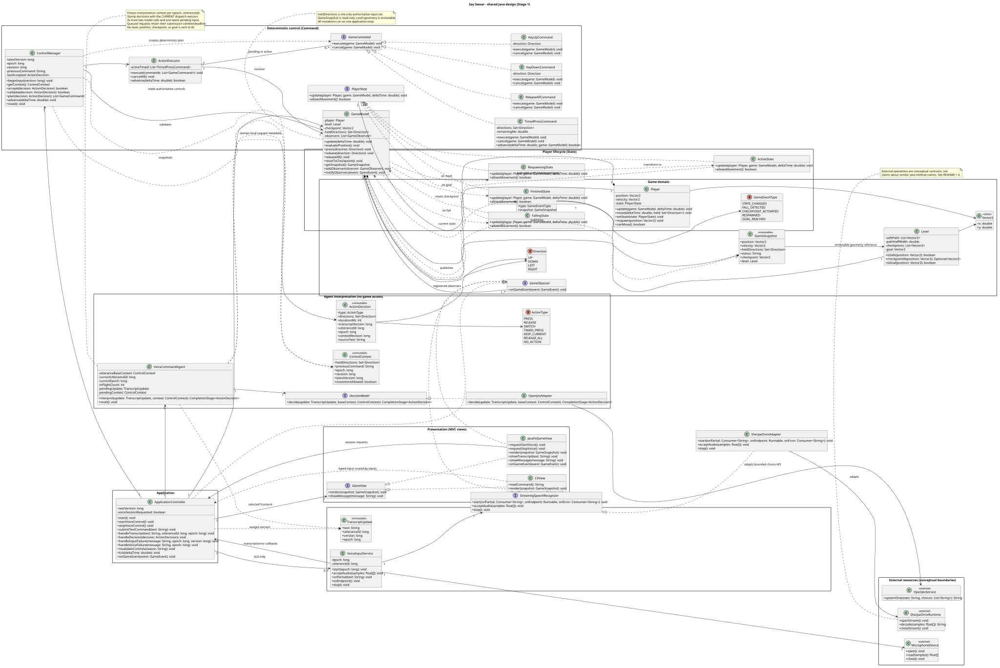
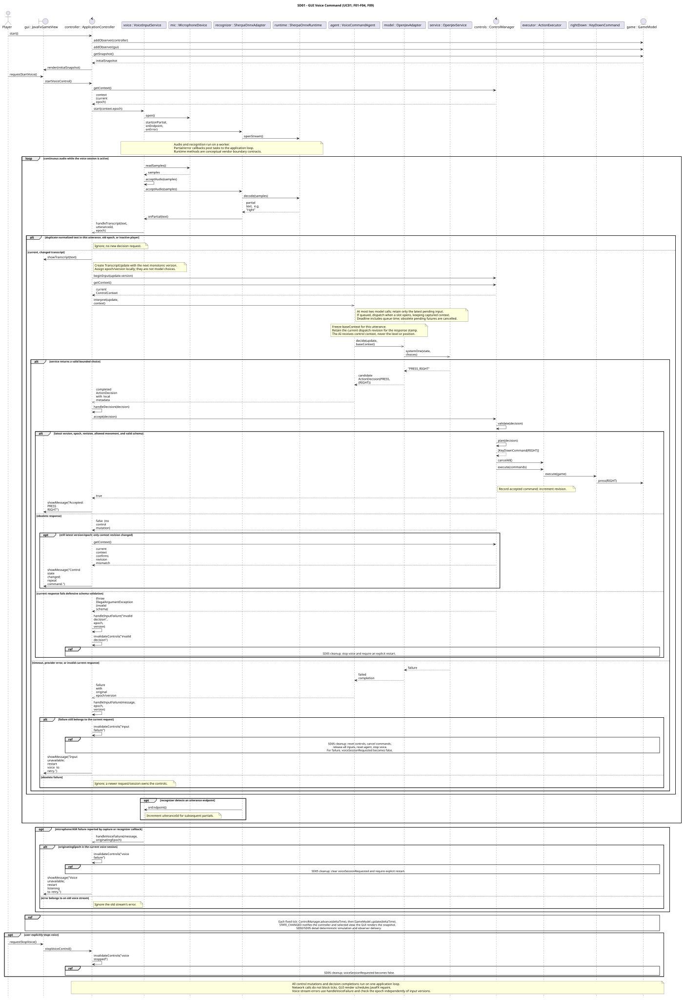
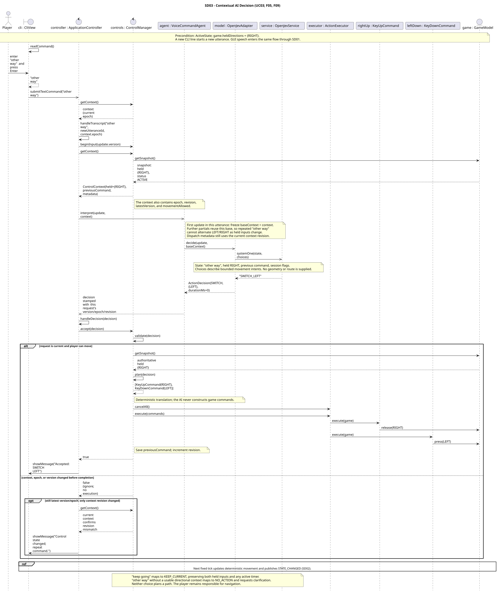
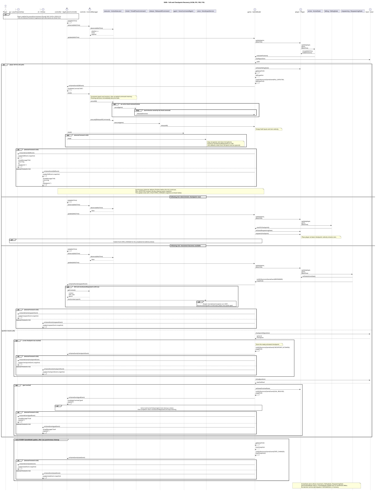

# Say Swear

**Say Swear: An AI Voice-Controlled 2D Precision Game**

EECS 3311 · Fall 2026 · Stage 1 Project Design Report

**Archive note:** this report preserves the original Stage 1 design. Its diagram links target the unchanged original sources/SVGs under [uml/stage1/](uml/stage1/). The [current implementation diagrams](uml/) and [design-change record](design-changes.md) describe subsequent start recovery and repeat support.

This submission describes the proposed design. Application implementation belongs to later stages. The course's 13-page `stage1.pdf` is the authoritative Stage 1 specification; the professor's clarification requires Java and both GUI and CLI access. PlantUML source files and their exported SVG diagrams accompany this report.

## 1. Project Overview

### 1.1 Problem and Motivation

Say Swear explores how a player can control a precision game through continuous natural language. A player must guide one character along a narrow, winding path suspended over a void. Leaving the path causes a fall and a return to the latest checkpoint. Reaching the goal finishes the level.

Spoken instructions are less rigid than keyboard controls: “other way” depends on what is currently held, “a little left” implies a short action, and “right — no, left” revises an earlier intention. The design challenge is to interpret these instructions while keeping movement predictable and allowing corrections to interrupt pending work. Speech recognition, interpretation, command execution, and game simulation therefore have separate responsibilities.

The level contains one player, a fixed path, checkpoints, a void, and a goal. Movement uses the four cardinal directions, with perpendicular pairs permitted for diagonal motion. There are no enemies, jumping, inventory, NPCs, procedural generation, quests, or combat. The human chooses the route and timing. The AI receives no map or goal coordinates and performs no autonomous navigation or pathfinding.

### 1.2 Target Users

- Players interested in a small precision/rage game where speaking is the control challenge.
- Players who want to try a voice interface rather than direct movement keys, without a claim that voice alone meets every accessibility need.
- Course evaluators and developers who need to inspect the same agent through a graphical game and a reproducible terminal interaction.

### 1.3 Agent Description

`VoiceCommandAgent` is a bounded control agent used by **both** frontends. It observes the latest natural-language instruction and a snapshot of control context, remembers the previous accepted command and the starting context of the current utterance, asks `DecisionModel` to select a semantic action, and returns an `ActionDecision`. A deterministic controller then validates that proposal and carries out the corresponding game commands. Subsequent input and actual control state feed the next interpretation.

This observe–interpret–act–observe loop supports contextual decision making and short-term memory. For example, “other way” with `RIGHT` held means switch to `LEFT`; “keep going” preserves the current inputs; “a little right” requests a bounded timed press. A revised transcript can replace an earlier interpretation before or after that earlier action starts. These interactions make the model part of an ongoing control loop rather than a single isolated text response.

The agent may choose only the actions in `ActionType`. It cannot call `GameModel`, create arbitrary executable code, choose a destination, or plan a sequence of future route instructions. There is no background AI action without new player input. The application, rather than the AI, decides whether a response is current, legal, and executable.

### 1.4 AI Models and Components

| Component | Planned model/backend | Application boundary and responsibility |
|---|---|---|
| Streaming speech recognition | sherpa-onnx runtime with the English `sherpa-onnx-streaming-zipformer-en-2023-06-26` model | `StreamingSpeechRecognizer`, implemented by `SherpaOnnxAdapter`, receives audio chunks and emits partial text and endpoint/error callbacks. `VoiceInputService` handles microphone capture and utterance identity. |
| Natural-language decision making | OpenJev, initially using the hosted `openjev` model alias | `DecisionModel`, implemented by `OpenJevAdapter`, selects from a finite set of semantic action choices using the transcript and permitted control context. |

sherpa-onnx documents desktop Java support and a Java microphone example. The example supplies samples to an online stream, decodes available audio, reads partial text, and resets the stream at an endpoint. Java bindings require matching native libraries and model files. Our adapter hides those details; transcript versions and session tokens are application metadata. See the [desktop Java documentation](https://k2-fsa.github.io/sherpa/onnx/java-api/non-android-java.html), [official streaming Java example](https://github.com/k2-fsa/sherpa-onnx/blob/master/java-api-examples/StreamingAsrFromMicTransducer.java), and [English model documentation](https://k2-fsa.github.io/sherpa/onnx/pretrained_models/online-transducer/zipformer-transducer-models.html#csukuangfj-sherpa-onnx-streaming-zipformer-en-2023-06-26-english).

The OpenJev API accepts structured `state` and `questions` at `/v1/systemone`. A choice question returns a selected choice. `OpenJevAdapter` will ask **one** choice question whose alternatives encode compatible action, direction set, and duration bucket combinations. It maps the returned label into our application value object; the provider does not return a trusted Java command. The `openjev` alias is not a pinned model version. See the [OpenJev API reference](https://openjev.sh/docs/advanced).

The model request contains the latest text, the utterance's initial held directions, previous accepted command, and whether movement is allowed. It excludes level geometry, player position, checkpoint position, and goal position. Request version, session epoch, and context revision are attached locally to the result and cannot be selected by the model. Provider credentials are deployment configuration and do not belong in source control. Short-phrase recognition quality and end-to-end responsiveness remain Stage 2 measurements; “real-time” describes the intended interaction, not a measured performance result.

In the UML, `MicrophoneDevice`, `SherpaOnnxRuntime`, and `OpenJevService` are external conceptual boundaries. Their operations summarize Java Sound capture, sherpa stream/decode operations, and the OpenJev HTTP request respectively. They are not additional application implementations or claims about exact vendor method names.

### 1.5 Overall Architecture

One Java application core serves one selected frontend per launch. Both frontends use the same `ApplicationController`, `VoiceCommandAgent`, `DecisionModel`, `ControlManager`, `ActionExecutor`, and `GameModel` classes and rules.

```text
GUI: microphone -> VoiceInputService -> StreamingSpeechRecognizer
                                         (SherpaOnnxAdapter)
                                                  |
                                            partial text
                                                  v
JavaFxGameView <------------------------ ApplicationController
                                                  ^
                                                  |
CLI: player -> CliView -> typed natural-language text

ApplicationController -> VoiceCommandAgent -> DecisionModel
                                               (OpenJevAdapter)
                                                     |
                                               ActionDecision
                                                     v
ApplicationController -> ControlManager -> ActionExecutor
                                              -> GameCommand objects
                                              -> GameModel / Player / Level
                                                     |
                                                GameEvent
                                                     v
                                   selected GameView and controller
```

**GUI.** `JavaFxGameView` draws the full 2D path, character, checkpoints, and goal; displays held directions, lifecycle status, transcript, and voice status; and provides Start/Stop Listening controls. Speech supplies movement instructions. Keyboard events do not directly move the player. Stop Listening is a session control that immediately clears movement through the deterministic cleanup path.

**CLI.** `CliView.readCommand()` accepts a line of natural language and the controller routes it through the same agent. The view displays a fixed-scale ASCII overview of the level with path (`.`), void (space), player (`P`), checkpoints (`C`), and goal (`G`), plus exact coordinates, velocity, held directions, current checkpoint, lifecycle state, accepted action, and messages. This gives the human enough information to navigate. Text replaces F02/F03's microphone/transcription path; F01 and F04–F10 retain the same behavior. Blocking line input runs separately from the application loop, so movement and timed releases continue while the user types. Periodic state output is throttled and prompts are redrawn to keep the terminal usable; falls, checkpoints, decisions, and completion are announced immediately.

**Deterministic simulation.** `ApplicationController.tick(deltaTime)` advances command timers and then calls `GameModel.update(deltaTime)` on a fixed-step loop, planned at 60 updates per second. `Player.move()` converts the held direction set to velocity and position. Diagonal velocity is normalized so it is no faster than cardinal movement. This small design uses immediate direction changes and stopping; acceleration is unnecessary. `Level` holds immutable centerline points and a path half-width, checkpoint positions, and the goal. Safety means the player's defined collision footprint remains within the path corridor. Checkpoint/goal overlap tests are deterministic. Geometry, speed, and collision footprint will be tuned together to avoid skipping narrow path sections at the chosen step size.

**Serialization.** Input callbacks and asynchronous model completions are posted to one application loop. The loop owns all game/control mutations and observer dispatch. ASR, HTTP calls, microphone capture, and terminal reads do not block it. JavaFX draws immutable snapshots on its own UI thread. The GUI and CLI observe state; neither maintains a second simulation. `GameModel.heldDirections` is authoritative; `ControlContext` is a copy of that state, not a competing input store.

#### Control and decision contract

`ApplicationController.handleTranscript(text, utteranceId, epoch)` rejects callbacks from an old session or a player state that disallows movement. It normalizes whitespace/case and suppresses identical text within an utterance, then assigns a monotonically increasing transcript version and creates `TranscriptUpdate`. CLI lines each receive a new utterance ID. `VoiceInputService` advances the utterance ID at an ASR endpoint and captures the epoch when starting its stream. Its callbacks retain that originating epoch even if a later stream starts.

`ControlManager.beginInput()` records the newest version before interpretation begins. The agent freezes the interpretation context for each `(epoch, utteranceId)` so a revised “other way, please” cannot reverse a direction twice merely because the first partial already took effect. Each request also captures the **current** dispatch revision for result validation. The agent stamps that revision onto its result independently of the frozen interpretation context. New utterances use fresh context.

To bound streaming load, `VoiceCommandAgent.interpret()` admits at most two concurrent model requests and retains at most one latest pending update. A newer pending update replaces the older pending one; superseded pending futures complete as cancelled and are ignored by their old version. A free slot dispatches the latest pending request. Each request retains the context captured when the controller submitted it to the agent; queuing never silently refreshes that context. The one-second decision deadline starts at that submission, including queue time, while each HTTP call also has a finite timeout. A current queued request that expires follows the same input-failure cleanup. Reset drops pending work and invalidates outstanding results; provider cancellation is best effort and slots remain occupied until calls finish/cancel. This bounds resource use without letting model latency block simulation.

| `ActionType` | Meaning and deterministic realization |
|---|---|
| `PRESS` | Set the complete desired direction set for an ordinary movement instruction. Release unwanted directions and issue idempotent `KeyDownCommand` objects for desired directions. |
| `RELEASE` | Remove the named directions from the held set. Remaining desired directions are restored if cancellation removed a timed hold. |
| `SWITCH` | Set the complete desired set for an explicit correction/reversal. `SWITCH_LEFT` is a provider choice label mapped to `SWITCH` with `{LEFT}`, not an extra enum value. |
| `TIMED_PRESS` | Replace current directions with the requested set for one allowed duration using `TimedPressCommand`, then release them. Allowed buckets are 100, 200, or 400 ms; “a little” initially maps to 200 ms. |
| `KEEP_CURRENT` | Preserve held directions and any existing timer; do not extend its expiry. With no direction held, remain stopped and explain that nothing is active. |
| `RELEASE_ALL` | Cancel pending/timed work and execute `ReleaseAllCommand`. “Stop” maps here. |
| `NO_ACTION` | Leave movement/timers unchanged and show that the instruction was not understood or is unsupported. It never invents a direction. |

Only the four `Direction` values are legal. Direction-bearing actions require one cardinal direction or two perpendicular directions; `UP+DOWN` and `LEFT+RIGHT` are invalid. `KEEP_CURRENT`, `RELEASE_ALL`, and `NO_ACTION` have empty direction sets and zero duration. Only `TIMED_PRESS` may have a nonzero duration. “Other way” reverses each held axis; with nothing held it produces `NO_ACTION`. Instructions to solve the route or move toward the goal produce `NO_ACTION`.

`ControlManager.accept()` first checks epoch, newest transcript version, captured context revision, and lifecycle eligibility. A stale result returns `false` with no effect. A current result then undergoes schema/action validation; invalid data raises `IllegalArgumentException`, caught by the controller and treated as an input failure. An identical semantic decision for an already accepted utterance is suppressed, so incremental text/finalization cannot restart a timed press. The duplicate key includes epoch, utterance ID, action type, direction set, and duration. A different accepted correction in the same utterance replaces that key.

For a new action, `plan()` computes the desired set from the pre-cancellation snapshot. The executor cancels pending and timed commands **before** executing the replacement plan in the same loop turn. The plan includes presses for every desired direction, even ones previously held, because cancellation may have released them. `KEEP_CURRENT`, `NO_ACTION`, and semantic duplicates preserve existing timers. Instant commands finish immediately; only timed commands remain active. Cancelling a down/timed command releases its direction(s); cancelling an already applied up/release-all command is a no-op. Cancellation never rewinds position.

The control revision advances when an accepted nonduplicate decision changes remembered command/control context, when a timer expires, and on reset. A result based on an expired timer's context is rejected with a “control state changed; repeat command” message. No automatic reinterpretation is needed. Timers advance on the application loop through `ControlManager.advance()` and `ActionExecutor.advance()`, with no delayed callback capable of releasing a newer command.

`deltaTime` is measured in seconds; timed commands convert it to milliseconds. Durations are simulation-time targets quantized to the fixed step, with at most one tick of tolerance (about 16.7 ms at 60 Hz). Since timers advance before movement, the first tick after acceptance can consume one step immediately; a 200 ms press may therefore provide up to one step less simulated movement. This convention is shared by both frontends, and elapsed wall time during a stalled application is not promised as precise movement time.

Provider failure, malformed output, or a provisional one-second decision timeout for the current request calls `handleInputFailure()`. The controller clears controls and stops a GUI voice session, displaying the cause and a restart instruction. Old request failures are ignored. CLI input resumes with the next explicit line. Microphone/ASR errors instead call `handleVoiceFailure(message, epoch)`: this checks only the originating session epoch, so new transcript versions cannot hide a broken current audio stream. It immediately stops the session and clears controls; an old stream's error is ignored. Ordinary silence preserves an intentional held command; it is not a failure. A new instruction keeps the previous movement until its valid decision arrives, unless fall, goal, session stop, or a failure clears it first.

#### Game lifecycle and cleanup

`Player` delegates to its current `PlayerState`. `ActiveState` permits movement and checks position. A fall enters `FallingState`, which disallows new movement. `FALL_DETECTED` synchronously notifies the controller: `invalidateControls()` increments the epoch via `ControlManager.reset()`, cancels active/pending work, executes `ReleaseAllCommand`, resets agent memory, and closes any voice stream. `GameModel.releaseAll()` clears held directions **and velocity**. Pending AI results and old audio callbacks are now invalid.

On the next simulation tick, `FallingState` requests `resetToCheckpoint()`, which enters `RespawningState` and restores checkpoint position with zero velocity. On the following tick, `RespawningState` enters `ActiveState` and emits `RESPAWNED`. A previously requested GUI voice session restarts with the new epoch; controls remain neutral until fresh speech. Stopping listening or an input failure clears that request, so those cases require explicit restart. The initial checkpoint is the start position. Checkpoints are visited in level order; reaching a later checkpoint updates the recovery point, while revisiting an earlier one does not move it backward. Goal contact enters `FinishedState`, clears controls, closes voice input, and displays completion. Finished states reject movement.

`GameModel` emits `STATE_CHANGED` with a fresh snapshot after each update and also emits checkpoint, fall, respawn, and goal events. Event snapshots are immutable facts captured at publication time. A fall snapshot can briefly describe the pre-cleanup inputs; the end-of-update snapshot contains cleared controls. Observers must not depend on notification ordering between the view and controller.

## 2. Feature Specifications

### F01 — Real-Time Precision Movement

- **Description:** Move one character along the fixed narrow path using deterministic four-direction game logic; reaching the goal ends the run.
- **User Interaction:** In the GUI, the player watches the level and speaks movement instructions. In the CLI, the player types the same instructions and reads the map/status display.
- **Input:** Validated held direction set, fixed simulation timestep, player state, and level geometry.
- **Output:** Updated position/velocity and visible state; checkpoint or goal events when reached.
- **AI Involvement:** **Deterministic.** Interpretation is provided by F04/F05; the movement rules themselves use no model.
- **Expected Workflow:** Execute accepted commands; advance timers; update the active player; normalize diagonal speed; evaluate path/checkpoint/goal overlap; publish a snapshot.
- **Error/Alternative Cases:** No held input gives zero velocity. Nonactive lifecycle states do not move. Leaving the path invokes F10; goal contact clears controls and finishes. Invalid directions are rejected before simulation.

### F02 — Continuous Voice-Control Session

- **Description:** Keep microphone capture active throughout a requested GUI play session without requiring a recording button for each instruction.
- **User Interaction:** The player selects Start Listening, observes the listening/status indicator, and speaks repeatedly. Stop Listening ends capture and clears controls. CLI access uses repeated text lines instead.
- **Input:** Start/stop session request, microphone access, and the current session epoch.
- **Output:** A running audio stream and listening/error status; neutral controls after session stop.
- **AI Involvement:** **Deterministic.** Session/capture management coordinates the AI transcription feature F03.
- **Expected Workflow:** Controller starts `VoiceInputService`; it opens the microphone and recognizer; audio chunks stream while listening; fall recovery replaces the stream with a fresh epoch; explicit stop closes resources and clears controls.
- **Error/Alternative Cases:** Missing microphone, permission denial, or capture failure reports the cause and clears movement. Repeated Start does not open a second stream. Goal completion stops the session. CLI needs no microphone.

### F03 — Streaming Speech Transcription

- **Description:** Produce incremental text while speech is still arriving, allowing a recognizable partial instruction to be considered before the utterance ends.
- **User Interaction:** The GUI displays the evolving transcript while the player speaks. CLI text is already transcribed input and bypasses this feature.
- **Input:** Audio samples, configured sample rate/model files, endpoint callbacks, and the originating session epoch.
- **Output:** Partial transcript text, utterance boundaries, and application-assigned versions sent to the controller.
- **AI Involvement:** **AI-based.** The ASR model infers text from audio; Java handles delivery and ordering.
- **Expected Workflow:** Service supplies chunks through `StreamingSpeechRecognizer`; `SherpaOnnxAdapter` decodes available samples and emits text; service forwards partials; the controller displays changed text and dispatches eligible versions without waiting for a final recording.
- **Error/Alternative Cases:** Empty/unchanged partials do not trigger decisions. Later revised text supersedes earlier request versions. Native-library/model failure stops listening and clears controls. Recognition mistakes remain visible and can be corrected through F06.

### F04 — Natural-Language Movement Interpretation

- **Description:** Interpret direct instructions such as “left,” “go up,” and “stop” as bounded semantic actions.
- **User Interaction:** The player speaks in the GUI or types a CLI line; the frontend displays the accepted action or interpretation message.
- **Input:** Latest transcript/text, control context, and the finite action-choice vocabulary.
- **Output:** An `ActionDecision` such as `PRESS {UP}` or `RELEASE_ALL`, followed by validated movement commands.
- **AI Involvement:** **Hybrid.** OpenJev selects meaning; Java validates and executes it.
- **Expected Workflow:** Controller versions input; agent requests a decision; adapter maps the selected label; controller forwards the result to control validation; executor applies the deterministic plan; the view shows the resulting state.
- **Error/Alternative Cases:** Unsupported or unclear requests produce `NO_ACTION` and a message. Malformed provider output or timeout clears movement. A stale response is discarded. Requests for autonomous route solving are unsupported.

### F05 — Context-Aware Commands

- **Description:** Interpret relative instructions using active inputs and command memory, including “other way” and “keep going.”
- **User Interaction:** The player issues a contextual instruction in either frontend and sees the resulting held directions.
- **Input:** Text, held directions, previous accepted command, and the frozen starting context of the current utterance.
- **Output:** A context-dependent decision, such as `SWITCH {LEFT}` when `RIGHT` was held, or `KEEP_CURRENT`.
- **AI Involvement:** **Hybrid.** AI resolves the reference; Java enforces the permitted action and freshness rules.
- **Expected Workflow:** Snapshot context; preserve its baseline for the utterance; request a bounded decision; validate against the current dispatch revision; translate and execute any required changes; update accepted-command memory.
- **Error/Alternative Cases:** “Other way” with no active direction yields `NO_ACTION`; “keep going” while stopped stays stopped. A timer expiring during inference invalidates the old context. Repeated partials from one utterance cannot repeatedly reverse an accepted direction.

### F06 — Live Command Correction / Interruption

- **Description:** Let newer instructions replace active movement and invalidate older outstanding interpretations.
- **User Interaction:** The player says “right — no, left” in the GUI or enters “left” after a prior CLI “right.” The GUI shows transcript revisions; both views show the accepted replacement.
- **Input:** Revised/new text, monotonically increasing version, active/pending actions, and control context.
- **Output:** Cancellation of obsolete work and the latest valid replacement action, without simultaneous opposite directions.
- **AI Involvement:** **Hybrid.** AI identifies the corrected intent; Java orders, cancels, and replaces actions.
- **Expected Workflow:** Mark the newest input version; interpret its meaning; reject older responses; validate the current result; cancel pending/timed work; release unwanted directions; apply the replacement atomically on the loop.
- **Error/Alternative Cases:** Network responses may arrive out of order; older versions have no effect. A failed current interpretation clears controls. A correction after a fall is rejected until recovery; fresh input is then required.

### F07 — Combined Directional Commands

- **Description:** Allow a single instruction to hold two perpendicular directions, such as “up and right.”
- **User Interaction:** The player speaks/types a combined instruction and sees diagonal movement plus both held directions in the GUI/CLI status.
- **Input:** Natural-language direction combination and current controls.
- **Output:** A validated direction set such as `{UP, RIGHT}` and two corresponding presses in one loop turn.
- **AI Involvement:** **Hybrid.** AI extracts the combination; Java validates compatibility and computes motion.
- **Expected Workflow:** Interpret the complete desired set; cancel an older timed action if necessary; release unwanted inputs; press both requested directions; normalize resulting velocity during simulation.
- **Error/Alternative Cases:** Opposing directions are not applied. Clear self-correction follows F06; unresolved contradictory speech yields `NO_ACTION`. A provider response containing a contradictory set fails validation and clears controls.

### F08 — Magnitude / Timed Commands

- **Description:** Turn a small-magnitude phrase such as “a little left” into a temporary input that releases automatically.
- **User Interaction:** The player speaks/types the phrase and observes a brief movement followed by neutral input; either frontend can interrupt it with a newer instruction.
- **Input:** Text, legal direction set, allowed duration buckets, and elapsed simulation time.
- **Output:** `TIMED_PRESS`, initially 200 ms for “a little,” followed by release without a second user command.
- **AI Involvement:** **Hybrid.** AI selects a bounded magnitude choice; Java owns the actual duration and release.
- **Expected Workflow:** Adapter maps the choice to a legal duration; manager validates; executor starts `TimedPressCommand`; each tick reduces remaining time; expiry releases its directions and updates control revision.
- **Error/Alternative Cases:** A duplicate partial/final result does not restart the timer. A correction cancels the old timer before replacement. Fall/session stop cancels it. Out-of-range duration is invalid. Small movement does not guarantee safety or a particular distance under delayed interpretation.

### F09 — Control-State and Conflict Management

- **Description:** Keep authoritative active inputs consistent and prevent contradictory, duplicated, or stale work from affecting gameplay.
- **User Interaction:** Both views display held inputs and feedback when a command is stale or rejected. The player can issue “stop”; the GUI also offers Stop Listening for immediate session cleanup.
- **Input:** Decision schema, version/epoch/revision, current lifecycle, held set, and pending/timed commands.
- **Output:** One accepted deterministic command plan or a rejection, with coherent state and bounded timer ownership.
- **AI Involvement:** **Deterministic.** Validation, freshness, cancellation, and conflict rules do not ask the model to judge its own output.
- **Expected Workflow:** Check request identity and lifecycle; validate type/directions/duration; suppress semantic duplicates; compute the desired set; cancel obsolete work; execute and record accepted context; invalidate all prior work on reset.
- **Error/Alternative Cases:** Old versions/epochs/revisions are ignored. Current malformed decisions invoke cleanup. Opposing directions never enter the model's held set. Cancellation is idempotent. A stale timer cannot release a newer press because timers execute only through the serialized loop.

### F10 — Fall Detection and Checkpoint Recovery

- **Description:** Detect leaving the safe path, clear all control activity, and respawn at the latest reached checkpoint.
- **User Interaction:** The GUI shows falling/recovery and the checkpoint location. The CLI prints the same events and refreshed map. The player resumes with a new command after recovery.
- **Input:** Player collision footprint, level geometry, checkpoint, current state, and pending/active controls.
- **Output:** Fall event, cancelled commands, empty held set, zero velocity, restored checkpoint position, and an active player ready for fresh input.
- **AI Involvement:** **Deterministic.** Fall detection, state transitions, and recovery use no AI decision.
- **Expected Workflow:** `ActiveState` detects unsafe position through the model; enter `FallingState`; notify observers; controller invalidates the epoch and clears controls; next tick restores position in `RespawningState`; following tick returns to `ActiveState` and refreshes the view.
- **Error/Alternative Cases:** Before any checkpoint, recover at the start. Old decisions/audio/timers cannot survive the reset. Commands during recovery are ignored. If microphone restart fails, remain neutral and show an error. Goal completion uses `FinishedState` instead of respawning.

## 3. UML Class Diagram



[PlantUML source](uml/stage1/class-diagram.puml)

The diagram groups presentation, application coordination, game domain, lifecycle states, voice adaptation, interpretation, and deterministic controls. Solid associations represent retained collaborators; dashed dependencies represent use. Interface realizations make the two frontend implementations, adapters, states, and concrete commands explicit. `GameModel` composes one player and one level; `Player` owns one current state. Observers are shared registrations, so their relationship is aggregation rather than ownership. The controller keeps one selected view and an optional GUI-only voice service. Values and external resources are labelled separately.

## 4. Design Patterns

### 4.1 MVC

**Problem addressed:** JavaFX drawing and terminal I/O must expose the same game/agent behavior without separate rules or simulations.

**Participants and roles:** `GameModel` is the model and owns `Player`, `Level`, held inputs, and checkpoint state. `GameView` is the presentation contract. `JavaFxGameView` draws the scene/transcript, and `CliView` renders textual state and reads lines. `ApplicationController` coordinates frontend input, interpretation, control execution, and the shared loop. Views consume `GameSnapshot` values instead of changing model fields.

**Why appropriate:** The two interfaces differ primarily in input capture and presentation. Their controller and domain collaborations are identical after text reaches the application boundary. A transcript from voice and a CLI line can exercise the same interpretation and command behavior.

**Without MVC:** Corrections, falls, or timer handling could be implemented differently in GUI callbacks and terminal loops. Keeping two versions in agreement and testing the core without JavaFX would become harder.

### 4.2 Command

**Problem addressed:** Semantic decisions must become small deterministic actions that can be interrupted and inspected independently of the AI provider.

**Participants and roles:** `GameCommand` declares `execute(GameModel)` and `cancel(GameModel)`. `KeyDownCommand` presses one direction; `KeyUpCommand` releases one; `TimedPressCommand` owns a bounded hold and its release; `ReleaseAllCommand` clears inputs/velocity. `ControlManager` creates the validated command plan. `ActionExecutor` invokes commands, retains active timed commands, and cancels pending work. `GameModel` is the receiver.

**Why appropriate:** A correction can cancel the executor's previous timed action before applying a new plan. The same command objects can later be logged and tested with fixed game state without calling an AI service. A command does not contain navigation decisions.

**Without Command:** Direct model writes would be scattered through model-response callbacks and timers. It would be harder to cancel a brief press, order releases before replacement presses, or establish which action caused a control change. Cancellation releases controls; it is not an undo of earlier movement.

### 4.3 Adapter

**Problem addressed:** Native streaming ASR and an external decision API have different data formats and lifecycles that should not spread into the game core.

**Participants and roles:** `StreamingSpeechRecognizer` is the ASR target interface; `SherpaOnnxAdapter` implements it and translates its operations/callbacks to the `SherpaOnnxRuntime` boundary. `VoiceInputService` is its client. `DecisionModel` is the decision target interface; `OpenJevAdapter` implements it and converts `OpenJevService` choice responses into `ActionDecision`; `VoiceCommandAgent` is its client.

**Why appropriate:** The controller works with text and bounded application values. It does not depend on sherpa stream objects, native packages, HTTP payloads, or provider labels. A later replacement or a test double can implement the same interfaces.

**Without Adapter:** Backend changes would force changes through session handling, the agent, and possibly command execution. External errors and incompatible output formats would be harder to normalize in one place.

### 4.4 Observer

**Problem addressed:** A fall or goal affects both presentation and control cleanup, while checkpoint and movement updates need to reach the selected view.

**Participants and roles:** `GameModel` is the publisher and maintains registered `GameObserver` objects. `GameObserver.onGameEvent()` is the subscriber contract. `GameEvent` contains `GameEventType` and a snapshot. `JavaFxGameView` and `CliView` display events. `ApplicationController` reacts to fall, respawn, and completion to invalidate/restart/stop controls as appropriate.

**Why appropriate:** The game announces domain events without importing UI or AI classes. One controller and the selected view subscribe to the same source. Synchronous dispatch on the application loop lets a fall invalidate pending work before the next movement tick.

**Without Observer:** The model would need explicit references to JavaFX, the terminal, and cleanup logic, or those components would repeatedly poll for changes. Adding a new event display would risk touching game rules. Snapshot rendering remains separate from mutating control state.

### 4.5 State

**Problem addressed:** Movement, fall handling, checkpoint reset, and completion permit different operations at different lifecycle stages.

**Participants and roles:** `Player` is the context holding `PlayerState`. `PlayerState.update()` and `allowsMovement()` define state behavior. `ActiveState` moves and requests position checks. `FallingState` prevents movement and initiates checkpoint reset on the next tick. `RespawningState` prevents movement until it transitions to active on the following tick. `FinishedState` rejects movement and performs no simulation movement. `GameModel` triggers fall/goal transitions and performs checkpoint reset.

**Why appropriate:** Each state's movement permission and update behavior are explicit. Both frontends and control validation consult the same lifecycle rule through the model snapshot rather than maintaining separate “dead” or “finished” flags.

**Without State:** Fall, active, respawn, and finished checks would be repeated across movement, input acceptance, update, and recovery code. It would be easier for a late command to move the character during respawn or after completion.

## 5. Use-Case Diagram


[PlantUML source](uml/stage1/use-case-diagram.puml)

The player is the primary actor. `MicrophoneDevice`, `SherpaOnnxRuntime`, and `OpenJevService` are supporting external resources/services. UC01 and UC02 provide complete play interactions. UC03–UC06 extend those interactions when contextual speech, correction, combined/timed input, or a fall occurs. These conditional behaviors are not required for every ordinary movement command. There is no administrator role.

## 6. Detailed Use Cases

### UC01 — Play Using Continuous Voice Control

- **Use Case ID:** UC01
- **Use Case Name:** Play Using Continuous Voice Control
- **Actor(s):** Player (primary); `MicrophoneDevice`, `SherpaOnnxRuntime`, and `OpenJevService` (supporting).
- **Goal:** Navigate the level by speaking continuous natural-language instructions and see the resulting gameplay.
- **Preconditions:** GUI frontend selected; one level loaded; player initially active at the start/current checkpoint; required ASR files and decision-service configuration available.
- **Trigger:** Player selects Start Listening and speaks.
- **Main Success Scenario:**
  1. Controller subscribes the view and itself to the model and presents the initial level.
  2. Voice service opens microphone capture and streaming recognition for the current epoch.
  3. ASR emits an eligible partial transcript; the GUI displays it.
  4. Controller versions the text and snapshots context; the agent asks OpenJev for a bounded decision.
  5. Controller validates the response through `ControlManager`; executor applies the command plan.
  6. The shared loop updates position and publishes snapshots. The player repeats instructions and chooses the route.
  7. Reached checkpoints become recovery points. At the goal, the model enters finished state, clears controls through the controller, stops listening, and displays completion.
- **Alternative/Exception Flows:** At step 2, capture/model initialization failure shows an error and keeps controls neutral. At steps 3–5, empty/duplicate text is suppressed, unsupported input yields `NO_ACTION`, stale results are ignored, and a current service failure clears controls. UC03–UC05 handle contextual, corrective, and combined/timed instructions. UC06 handles a fall. Stop Listening ends capture and clears controls before completion; the player can restart it.
- **Postconditions:** After success, goal completion is visible, inputs are released, and voice capture is closed. After voluntary stop/failure, the level position remains available with neutral inputs; after recovery the latest checkpoint is active.
- **Related Feature(s):** F01–F10.

### UC02 — Play Using CLI Commands

- **Use Case ID:** UC02
- **Use Case Name:** Play Using CLI Commands
- **Actor(s):** Player (primary); `OpenJevService` (supporting).
- **Goal:** Access the same navigation, interpretation, correction, timed controls, checkpoints, and completion through text.
- **Preconditions:** CLI frontend selected; level loaded; shared core initialized; decision-service configuration available.
- **Trigger:** Player enters a natural-language line at the terminal prompt.
- **Main Success Scenario:**
  1. Controller subscribes itself and `CliView` and displays the ASCII level with coordinates and held-input status.
  2. `CliView.readCommand()` collects a line while the independent application loop continues.
  3. `submitTextCommand()` assigns a new utterance and routes the text through the same versioned interpretation path as GUI text.
  4. Agent obtains a bounded decision; controller and manager validate it; executor changes the shared game inputs.
  5. The loop advances motion/timers and the CLI displays updated map/status and action feedback.
  6. The player repeats commands until reaching the goal; completion is displayed and controls are cleared.
- **Alternative/Exception Flows:** Empty lines do nothing. Unsupported text yields `NO_ACTION`. Provider failure clears movement and reports the error; the next explicit line retries. UC03–UC05 work identically with typed input. UC06 prints recovery events and resumes at the checkpoint. After goal completion, further movement lines are rejected.
- **Postconditions:** Current state and accepted/rejected action feedback are visible; successful completion leaves the player finished with no held controls. No voice resources are opened.
- **Related Feature(s):** F01, F04, F05, F06, F07, F08, F09, F10. F02/F03 are replaced by direct text entry.

### UC03 — Interpret Contextual Command

- **Use Case ID:** UC03
- **Use Case Name:** Interpret Contextual Command
- **Actor(s):** Player (primary); `OpenJevService` (supporting); GUI speech acquisition uses UC01's resources when applicable.
- **Goal:** Resolve a relative instruction against the player's current control intent.
- **Preconditions:** UC01 or UC02 is active; player can move; held inputs and previous accepted command are available as context.
- **Trigger:** Player speaks/types “other way” or “keep going.”
- **Main Success Scenario:**
  1. Controller obtains a new version and `ControlContext`; for the illustrated case, `RIGHT` is held.
  2. Agent preserves the utterance baseline and asks the decision model to interpret “other way.”
  3. OpenJev selects `SWITCH_LEFT`; the adapter maps it to `SWITCH {LEFT}` and the agent stamps local request metadata.
  4. Manager verifies freshness and validity and plans `KeyUpCommand(RIGHT)` followed by `KeyDownCommand(LEFT)`.
  5. Executor applies the plan and the next snapshot shows leftward input/movement.
- **Alternative/Exception Flows:** “Keep going” retains existing directions and timer. With no held direction, “other way” yields `NO_ACTION`; “keep going” stays stopped with feedback. For a perpendicular pair, reversal negates both axes. A context revision change during inference discards the result and asks the player to repeat. Service failure uses the shared cleanup path.
- **Postconditions:** The accepted contextual action is reflected in held inputs and command memory; invalid/stale output has not applied a direction. Timer ownership is preserved for `KEEP_CURRENT`.
- **Related Feature(s):** F05, F09.

### UC04 — Correct an Active Command

- **Use Case ID:** UC04
- **Use Case Name:** Correct an Active Command
- **Actor(s):** Player (primary); `OpenJevService` (supporting); GUI speech acquisition uses UC01's resources when applicable.
- **Goal:** Replace a previous instruction without waiting for that movement or its outstanding inference to finish.
- **Preconditions:** Player is active; a prior input is held or has an outstanding decision; either frontend is in use.
- **Trigger:** A revised transcript says “right — no, left,” or a new CLI line corrects the previous command.
- **Main Success Scenario:**
  1. Controller records the new transcript version as the only eligible version.
  2. Agent interprets the correction and proposes `SWITCH {LEFT}`.
  3. Manager validates the decision and computes the replacement direction set.
  4. Executor cancels old timed/pending commands, releases `RIGHT`, and presses `LEFT` within one application-loop turn.
  5. Command memory and the frontend state reflect the replacement; any later old response is ignored.
- **Alternative/Exception Flows:** If the old decision has not executed, it is invalidated before changing controls. Identical semantic revisions do not reapply the action. An unclear correction yields `NO_ACTION` with feedback and preserves existing controls. An invalid/current failed result clears movement. Fall or goal during inference invalidates the request entirely.
- **Postconditions:** Only the latest accepted instruction controls movement; cancelled timed work cannot later affect it. No opposing inputs have been applied together.
- **Related Feature(s):** F06, F09.

### UC05 — Execute Combined or Timed Command

- **Use Case ID:** UC05
- **Use Case Name:** Execute Combined or Timed Command
- **Actor(s):** Player (primary); `OpenJevService` (supporting); GUI speech acquisition uses UC01's resources when applicable.
- **Goal:** Express a perpendicular combination or small movement with one natural-language instruction.
- **Preconditions:** Player is active; core and chosen frontend are running; legal directions and duration buckets are configured.
- **Trigger:** Player speaks/types “up and right” or “a little left.”
- **Main Success Scenario:**
  1. Controller versions the input and requests interpretation with current context.
  2. Agent returns either `PRESS {UP, RIGHT}` or `TIMED_PRESS {LEFT}, 200 ms`.
  3. Manager verifies direction compatibility, duration, and freshness, then computes a replacement plan.
  4. Executor cancels obsolete work and applies both presses together, or starts one timed command.
  5. The shared loop shows normalized diagonal movement, or advances the timed command until it releases automatically; the selected view shows the result.
- **Alternative/Exception Flows:** A contradictory interpretation or illegal duration fails validation and clears controls. Ambiguous language yields `NO_ACTION`. Duplicate partials do not restart a timer. A new correction, stop, fall, or goal cancels an active timed action before any replacement. `KEEP_CURRENT` does not extend a running timer.
- **Postconditions:** Combined directions remain held until replaced/released; a completed timed action leaves its directions released. Cancellation leaves no pending expiry that can alter a later input.
- **Related Feature(s):** F07, F08, F09.

### UC06 — Fall and Recover

- **Use Case ID:** UC06
- **Use Case Name:** Fall and Recover
- **Actor(s):** Player (primary, observing recovery). GUI voice resources participate only when capture is restarted; no AI service decides recovery.
- **Goal:** Resume from the latest checkpoint with neutral controls after leaving the path.
- **Preconditions:** Player is active in UC01 or UC02; level and initial/latest checkpoint exist.
- **Trigger:** A simulation update places the player's collision footprint outside the safe path.
- **Main Success Scenario:**
  1. Model detects the unsafe position, enters `FallingState`, and emits `FALL_DETECTED`.
  2. Controller observes the event and increments the control epoch, cancels pending/timed commands, releases every direction, zeros velocity, resets agent memory, and closes old voice capture if present.
  3. View displays the fall and updated neutral controls from the ensuing snapshot.
  4. On the next tick, `FallingState` requests a reset; model enters `RespawningState` and restores checkpoint position.
  5. On the following tick, the player returns to `ActiveState` and emits `RESPAWNED`.
  6. View shows the restored position; requested GUI voice capture restarts under the new epoch, or CLI input continues. The player supplies a fresh instruction.
- **Alternative/Exception Flows:** With no later checkpoint reached, reset to the start. Commands/results/audio from before the fall are discarded. Input during falling/respawning is ignored. Microphone restart failure leaves neutral controls and a visible error. A goal event instead enters `FinishedState` and ends control; it does not trigger this recovery sequence.
- **Postconditions:** Player is at the latest checkpoint in active state, with zero velocity, no held inputs, no pending timers, and cleared prior command memory. Old work cannot move the respawned player.
- **Related Feature(s):** F10, F09.

## 7. Sequence Diagrams

These diagrams use class-diagram operation names. Dashed return messages describe data/results; notes describe construction or internal field assignment. Asynchronous provider work returns through the application loop. `ref` fragments refer to other numbered diagrams rather than introducing extra diagrams. External resource lifelines are the conceptual boundaries explained in §1.4.

### SD01 — GUI Voice Command



[PlantUML source](uml/stage1/sequence-diagrams/sd01-gui-voice-command.puml)

UC01's voice session opens capture, streams partial text, invokes bounded interpretation, validates and executes the result, and publishes game state. Alternatives show stale responses and current failures. F02 and F03 enter the same core used for F04 and F09.

### SD02 — CLI Text Command


[PlantUML source](uml/stage1/sequence-diagrams/sd02-cli-text-command.puml)

UC02 bypasses microphone capture and ASR, then uses the same controller, agent, decision adapter, control manager, commands, and model. The independent simulation loop and observer rendering expose F01 and F04–F09 through the terminal; lifecycle details are in SD05.

### SD03 — Contextual AI Decision



[PlantUML source](uml/stage1/sequence-diagrams/sd03-contextual-command.puml)

UC03/F05 shows “other way” with `RIGHT` held, context capture, OpenJev's semantic choice, and deterministic release/press commands. Alternatives cover unchanged control and missing context. The AI selects intent; it never presses a game key directly.

### SD04 — Live Correction / Combined / Timed Command


[PlantUML source](uml/stage1/sequence-diagrams/sd04-live-correction.puml)

UC04/UC05 and F06–F09 share replacement/validation mechanics. Branches show correction, a perpendicular combination, a brief timed press, semantic duplicate suppression, and stale/invalid responses. Timer expiry and cancellation both run through the same executor on the application loop.

### SD05 — Fall and Checkpoint Recovery



[PlantUML source](uml/stage1/sequence-diagrams/sd05-fall-recovery.puml)

UC06/F10 shows fall detection, synchronous observer cleanup, cancellation/release, distinct falling/respawning/active states, and view refresh. The safe-path alternative also shows checkpoint activation and goal completion for F01. `GameView`/`GameObserver` polymorphism applies to either frontend.

## 8. Feature-to-Design Traceability

Types classify each feature's responsibility, rather than every upstream component it uses. The classes and methods below are central collaborators; §9 describes the surrounding flow. Every UC and SD identifier refers to a numbered section above.

| Feature | Description | Type | Related Use Case | Classes | Key Methods | Sequence Diagram | Design Pattern(s) |
|---|---|---|---|---|---|---|---|
| F01 | Deterministic movement, checkpoints, and goal | Deterministic | UC01, UC02 | `ApplicationController`, `GameModel`, `Player`, `ActiveState`, `Level`, `GameView` | `ApplicationController.tick`, `GameModel.update`, `Player.move`, `GameModel.evaluatePosition`, `Level.isSafe`, `Level.checkpointAt`, `Level.isGoal`, `GameView.render` | SD02, SD05 | MVC, State, Observer |
| F02 | Continuous microphone session | Deterministic | UC01 | `JavaFxGameView`, `ApplicationController`, `VoiceInputService`, `StreamingSpeechRecognizer`, `SherpaOnnxAdapter` | `JavaFxGameView.requestStartVoice`, `ApplicationController.startVoiceControl`, `VoiceInputService.start`, `VoiceInputService.stop`, `ApplicationController.stopVoiceControl` | SD01 | MVC, Adapter |
| F03 | Incremental speech-to-text | AI-based | UC01 | `VoiceInputService`, `StreamingSpeechRecognizer`, `SherpaOnnxAdapter`, `ApplicationController`, `JavaFxGameView` | `VoiceInputService.acceptAudio`, `SherpaOnnxAdapter.acceptAudio`, `VoiceInputService.onPartial`, `VoiceInputService.onEndpoint`, `ApplicationController.handleTranscript`, `JavaFxGameView.showTranscript` | SD01 | Adapter, MVC |
| F04 | Direct instruction to bounded action | Hybrid | UC01, UC02 | `ApplicationController`, `VoiceCommandAgent`, `DecisionModel`, `OpenJevAdapter`, `ActionDecision`, `ControlManager`, `ActionExecutor` | `ApplicationController.submitTextCommand`, `VoiceCommandAgent.interpret`, `DecisionModel.decide`, `ApplicationController.handleDecision`, `ControlManager.accept`, `ActionExecutor.execute` | SD01, SD02 | Adapter, Command, MVC |
| F05 | Context-dependent interpretation | Hybrid | UC03; UC01, UC02 | `ControlManager`, `ControlContext`, `VoiceCommandAgent`, `OpenJevAdapter`, `ActionDecision`, `KeyUpCommand`, `KeyDownCommand` | `ControlManager.getContext`, `VoiceCommandAgent.interpret`, `OpenJevAdapter.decide`, `ControlManager.plan`, `KeyUpCommand.execute`, `KeyDownCommand.execute` | SD03 | Adapter, Command |
| F06 | Supersede active or pending instruction | Hybrid | UC04; UC01, UC02 | `ApplicationController`, `TranscriptUpdate`, `VoiceCommandAgent`, `ControlManager`, `ActionExecutor`, `KeyUpCommand`, `KeyDownCommand` | `ApplicationController.handleTranscript`, `ControlManager.beginInput`, `VoiceCommandAgent.interpret`, `ControlManager.accept`, `ActionExecutor.cancelAll`, `ActionExecutor.execute` | SD04 | Command, MVC |
| F07 | Compatible simultaneous directions | Hybrid | UC05; UC01, UC02 | `VoiceCommandAgent`, `ActionDecision`, `ControlManager`, `KeyDownCommand`, `Player` | `VoiceCommandAgent.interpret`, `ControlManager.validate`, `ControlManager.plan`, `KeyDownCommand.execute`, `Player.move` | SD04 | Command |
| F08 | Bounded temporary directional input | Hybrid | UC05; UC01, UC02 | `OpenJevAdapter`, `ControlManager`, `ActionExecutor`, `TimedPressCommand`, `GameModel` | `OpenJevAdapter.decide`, `ControlManager.accept`, `ControlManager.advance`, `ActionExecutor.advance`, `TimedPressCommand.execute`, `TimedPressCommand.advance`, `TimedPressCommand.cancel`, `GameModel.release` | SD04 | Adapter, Command |
| F09 | Freshness, conflict, and cancellation rules | Deterministic | UC01, UC02, UC03, UC04, UC05, UC06 | `ControlManager`, `ControlContext`, `ActionDecision`, `ActionExecutor`, `GameCommand`, `ReleaseAllCommand`, `GameModel` | `ControlManager.beginInput`, `ControlManager.validate`, `ControlManager.accept`, `ControlManager.reset`, `ActionExecutor.cancelAll`, `ReleaseAllCommand.execute`, `GameModel.releaseAll` | SD01, SD03, SD04, SD05 | Command |
| F10 | Fall, cleanup, and checkpoint reset | Deterministic | UC06; UC01, UC02 | `GameModel`, `Level`, `Player`, `FallingState`, `RespawningState`, `ActiveState`, `GameObserver`, `ApplicationController`, `ControlManager`, `ActionExecutor` | `GameModel.evaluatePosition`, `Level.isSafe`, `GameModel.notifyObservers`, `ApplicationController.onGameEvent`, `ApplicationController.invalidateControls`, `ControlManager.reset`, `GameModel.resetToCheckpoint`, `Player.respawn`, `Player.setState` | SD05 | Observer, State, Command, MVC |

## 9. Feature Implementation Explanations

These are proposed realization plans, not claims that application code already exists.

### F01 — Real-Time Precision Movement

**Related use cases:** UC01, UC02. **Related sequences:** SD02 (shared ticking/rendering), SD05 (position evaluation and outcomes).

**Classes and methods:** `ApplicationController.tick()` schedules `ControlManager.advance()` then `GameModel.update()`. `Player.update()` delegates to `ActiveState.update()`, which calls `Player.move()` and `GameModel.evaluatePosition()`. `Level.isSafe()`, `checkpointAt()`, and `isGoal()` classify the new position. `GameView.render()` displays the result through either concrete view.

**Execution:** Validated held inputs determine a normalized direction vector and fixed-speed movement. The model updates checkpoints, detects the goal or fall, and publishes `GameEvent` snapshots. Both views consume the same coordinates and state. Goal contact enters `FinishedState`; the controller clears controls and reports completion. No model call determines position or the route.

### F02 — Continuous Voice-Control Session

**Related use case:** UC01. **Related sequence:** SD01.

**Classes and methods:** `JavaFxGameView.requestStartVoice()` calls `ApplicationController.startVoiceControl()`. `VoiceInputService.start(epoch)` coordinates `MicrophoneDevice.open()` and `StreamingSpeechRecognizer.start()`, implemented by `SherpaOnnxAdapter`. `VoiceInputService.stop()` closes capture/recognition; `ApplicationController.stopVoiceControl()` also invalidates controls.

**Execution:** The service keeps reading audio chunks under a single session epoch and feeds the recognizer until stopped. Start is idempotent while a session is already running. Stop, failure, fall, and goal use the common cleanup mechanism; only fall recovery automatically resumes an already requested session. Session status appears through the GUI's `showMessage()`. This is resource/lifecycle management, separate from the speech inference in F03.

### F03 — Streaming Speech Transcription

**Related use case:** UC01. **Related sequence:** SD01.

**Classes and methods:** `VoiceInputService.acceptAudio()` calls `StreamingSpeechRecognizer.acceptAudio()`. `SherpaOnnxAdapter` translates chunks to its external runtime. Its callbacks invoke `VoiceInputService.onPartial()` and `onEndpoint()`. `ApplicationController.handleTranscript()` assigns versions and `JavaFxGameView.showTranscript()` displays text.

**Execution:** Decoding yields a changing partial transcript rather than waiting for a completed recording. The voice service tags callbacks with their stream epoch and utterance identity. The controller suppresses empty/identical text, exposes changes, and sends eligible updates into the shared agent pipeline. An ASR endpoint starts a new utterance identity; identical final text within the previous utterance does not execute twice. CLI commands join after this stage.

### F04 — Natural-Language Movement Interpretation

**Related use cases:** UC01, UC02. **Related sequences:** SD01, SD02.

**Classes and methods:** `ApplicationController.handleTranscript()` or `submitTextCommand()` creates input; `VoiceCommandAgent.interpret()` invokes `DecisionModel.decide()` through `OpenJevAdapter`. `ApplicationController.handleDecision()` forwards the application value to `ControlManager.accept()` and `ActionExecutor.execute()`.

**Execution:** OpenJev chooses a finite semantic alternative from text/context. The adapter maps the label into `ActionDecision`; the agent adds locally captured request metadata. For “go up,” the manager creates a plan ending in `KeyDownCommand(UP)`; for “stop,” it uses `ReleaseAllCommand`. The executor invokes commands that call the model's input methods. The controller reports the accepted action through `GameView.showMessage()`. Unsupported language gives a visible no-action result; service/schema failures clear controls instead of applying guessed output.

### F05 — Context-Aware Commands

**Related use cases:** UC03 within UC01/UC02. **Related sequence:** SD03.

**Classes and methods:** `ControlManager.getContext()` returns `ControlContext`; `VoiceCommandAgent.interpret()` manages the utterance baseline and calls `OpenJevAdapter.decide()`. `ControlManager.plan()` produces `KeyUpCommand.execute()` and `KeyDownCommand.execute()` operations when a switch is accepted.

**Execution:** With `RIGHT` held, the phrase “other way” and its baseline context yield the semantic choice `SWITCH_LEFT`. Java maps and validates that choice, releases right, and presses left. Context memory is updated after acceptance. A same-utterance revision uses the original interpretation baseline to prevent repeated reversal, while the dispatch revision still protects against unrelated control changes during inference. “Keep going” preserves both direction and any running timer.

### F06 — Live Command Correction / Interruption

**Related use cases:** UC04 within UC01/UC02. **Related sequence:** SD04.

**Classes and methods:** `ApplicationController.handleTranscript()` builds `TranscriptUpdate`; `ControlManager.beginInput()` marks the newest version; `VoiceCommandAgent.interpret()` resolves revised intent. `ControlManager.accept()` authorizes a replacement, then `ActionExecutor.cancelAll()` precedes `execute()`.

**Execution:** “Right” may already have pressed right when the transcript becomes “right — no, left.” The second version makes older outstanding responses ineligible. Once its left decision is accepted, obsolete timed work is cancelled, unwanted controls are released, and left is pressed in one serialized turn. A late first response cannot restore right. GUI partial corrections and separate CLI lines share this exact mechanism.

### F07 — Combined Directional Commands

**Related use cases:** UC05 within UC01/UC02. **Related sequence:** SD04.

**Classes and methods:** `VoiceCommandAgent.interpret()` returns an `ActionDecision` containing both directions. `ControlManager.validate()` checks compatibility and `plan()` creates two `KeyDownCommand` objects. Their `execute()` methods call `GameModel.press()`; `Player.move()` normalizes the combined vector.

**Execution:** “Up and right” resolves to one desired set `{UP, RIGHT}`. After cancellation/release of unwanted previous controls, both presses execute before the next simulation update. The player therefore moves diagonally with the same overall speed as a cardinal move. The model never receives an opposing pair; invalid combinations fail before command execution.

### F08 — Magnitude / Timed Commands

**Related use cases:** UC05 within UC01/UC02. **Related sequence:** SD04.

**Classes and methods:** `OpenJevAdapter.decide()` maps the chosen magnitude bucket to a bounded duration; `ControlManager.accept()` validates it. `TimedPressCommand.execute()` presses the directions, `ActionExecutor.advance()` calls `TimedPressCommand.advance()`, and expiry/cancellation invokes `cancel()` and `GameModel.release()`.

**Execution:** “A little left” creates a 200 ms timed hold. The executor retains the command and reduces its remaining duration each application tick. At expiry it releases left before the next movement update and informs `ControlManager` to advance context revision. A replacement first cancels and removes that timed command; no independent callback remains to release a newer left press. A duplicate semantic partial does not extend the 200 ms.

### F09 — Control-State and Conflict Management

**Related use cases:** UC01–UC06. **Related sequences:** SD01 (validation/failure), SD03 (context), SD04 (replacement/timers), SD05 (epoch reset).

**Classes and methods:** `ControlManager.beginInput()`, `getContext()`, `validate()`, `accept()`, and `reset()` govern decisions. `ActionDecision` carries local identity metadata; `ControlContext` copies actual held controls. `ActionExecutor.cancelAll()` and `ReleaseAllCommand.execute()` enforce cleanup through `GameModel.releaseAll()`.

**Execution:** The manager admits only a current request against an eligible lifecycle and legal action schema. It plans against the pre-cancellation held set, then executes cancellations and replacement commands atomically. Model-held inputs remain the authoritative source for future context and display. Reset increments the epoch, clears command memory/timers, and releases all controls. This separates model interpretation quality from hard guarantees about what the application will execute.

### F10 — Fall Detection and Checkpoint Recovery

**Related use cases:** UC06 within UC01/UC02. **Related sequence:** SD05.

**Classes and methods:** `GameModel.evaluatePosition()` calls `Level.isSafe()` and `Player.setState()`. `GameModel.notifyObservers()` calls `ApplicationController.onGameEvent()` and the concrete view's observer method. `invalidateControls()` triggers `ControlManager.reset()`. `FallingState.update()` calls `GameModel.resetToCheckpoint()`, which calls `Player.respawn()`; `RespawningState.update()` returns to active state.

**Execution:** An unsafe position immediately changes the lifecycle to falling, so new movement cannot be admitted. The fall event makes the controller cancel commands and reject pre-fall responses/audio through a new epoch. The next two ticks separate checkpoint restoration from return to active play. Fresh snapshots show neutral controls and the recovered position in either frontend. GUI capture resumes only if the player had left the voice session requested. Recovery never asks the AI where to move.

## 10. Stage 1 Design Summary

The proposed system contains ten meaningful features, two Java frontends sharing one core, two isolated AI integration boundaries, and five visibly represented design patterns: MVC, Command, Adapter, Observer, and State. Six use cases and five sequence diagrams connect the features to actual classes and methods. The AI interprets player intent; deterministic Java components own validation, cancellation, timing, movement, collision tests, checkpoints, and completion.

This repository contains design documentation, PlantUML sources, and all seven exported SVG diagrams. There is no executable application, model integration, measured latency, or implementation test result in Stage 1. Diagram sources have been checked for cross-reference and obvious syntax consistency; the SVG files have been checked for valid XML and PlantUML error messages.

### Assumptions and Items to Review Before Submission

- The professor's Java and dual-interface clarification is incorporated. The five selected patterns appear among the patterns listed in `stage1.pdf`.
- English speech is the initial ASR scope. Native packaging, microphone support, OpenJev access, short-command accuracy, and practical latency require Stage 2 verification. The hosted model alias may change; record the actual tested model/backend versions then.
- The 60 Hz loop, 100/200/400 ms magnitude buckets, and one-second decision timeout are initial design parameters. They need play testing against the final small level. The controller's concurrency/freshness rules remain required regardless of tuning.
- Checkpoints are in level order, the start is the initial checkpoint, and progression is session-local. Save/load and multiple levels are outside this design.
- All seven SVG exports are included at the paths referenced in this report. Review their readability in GitHub's README preview before submission.
- Use this same dedicated repository for all project stages. Before the course deadline, ensure it is **public**, commit and push the completed report and rendered diagrams, verify the repository URL opens correctly, and submit that URL through the course submission system. These publishing/submission steps are not claimed complete by this design report.
